# GCET231 Tutorial 4: Criando um Projeto no Quartus Prime

- Autor: João Bittencourt
- Data: 24 de abril de 2021
- Revisão: 1.4

**Sumário**

- Introdução
- Assistente de Criação de Projetos
- Explorando o Projeto Recém Criado
- Expandindo o Projeto Usando SystemVerilog
- Compilando o Projeto
- Analisando Graficamente o Circuito RTL
- Análise Temporal com TimeQuest

## Introdução

Nesse tutorial, você irá aprender a criar um projeto no **Intel Quartus Prime**, passando por todas as etapas do fluxo de projeto FPGA. O tutorial irá apresentar as ferramentas de projeto, mapeamento, síntese e prototipagem. Este tutorial leva em consideração que você já possui o Intel Quartus Prime instalado em seu ambiente de desenvolvimento e já completou os tutoriais referentes ao Git e Verilog.

O diagrama a seguir ilustra as etapas do fluxo de projeto do Intel Quartus Prime, e que será utilizada durante o semestre. Note que nem todas as etapas serão sempre e que algumas delas podem demandar de outras ferramentas de software.

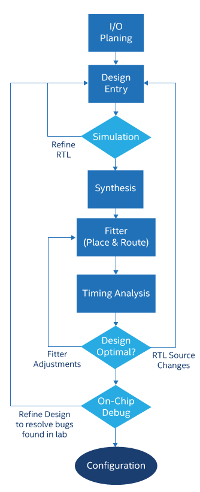

1. O circuito começa com a etapa de entrada (_Design Entry_). Veremos que é possível usar o assistente _New Project Wizard_ do Quartus Prime para criar um novo projeto, e quais são os principais elementos de customização para um projeto FPGA. Você pode expressar um projeto usando vários métodos de entrada. Entretanto, nos nossos projetos usaremos uma linguagem de descrição de hardware - HDL (Verilog, SystemVerilog ou VHDL), juntamente com o uso de núcleos de Propriedade Intelectual (IP-_cores_) desenvolvidos especialmente para o uso em FPGAs Intel. Com isso, desenvolveremos um circuito digital simples usando Verilog.
2. O processo continua com a simulação, etapa que tem como objetivo verificar se a lógica foi implementada como esperado. O Quartus Prime possui suporte para ambas as simulações, RTL e pós-síntese (_gate level simulation_). Nos nossos projetos utilizamos o ModelSim Intel Starter Edition (SE) para realizar nossas simulações. Esse processo pode ser realizado por intermédio do Quartus Prime, usando a ferramenta **NativeLink**, ou de forma independente, usando projetos do ModelSim Intel FPGA SE. O ModelSim é uma ferramenta de simulação que permite criar diagramas de tempo precisos para todos os sinais do projeto, bem como sinais de estímulo para teste e testbenchs automatizados em SystemVerilog.
3. A etapa de síntese (**Synthesis**) é realizada a partir da ferramenta de análise de síntese do Quartus Prime. Essa etapa é também chamada de mapeamento, e corresponde ao processo de síntese/mapeamento da lógica do circuito para elementos da arquitetura do dispositivo FPGA. Durante o mapeamento a ferramenta verifica por erros nos arquivos fonte e constrói uma base de dados que organiza todos os componentes do circuito em uma estrutura hierárquica. Essa estrutura é então sintetizada com o objetivo de otimizar a lógica dos circuitos. Por fim, a lógica do circuito é mapeada para recursos do dispositivo FPGA.
4. A etapa de **Fitter** é o principal desafio do projeto FPGA uma vez que ela tenta posicionar os elementos do circuito da maneira mais otimizada possível em termos de recursos lógicos. O Quartus Prime permite controlar o processo de _fitting_ escolhendo estratégias de posicionamento e roteamento com base em compromissos de projeto: balanceado, alto desempenho (velocidade), baixa potência, e menor área.
5. Após a etapa de _fitting_, o circuito pode ser analisando, tendo em vista verificar se o circuito corresponde ao esperado. O Quartus Prime possui várias maneiras de visualizar a representação dos diferentes aspectos do projeto através de figuras. Representações pictóricas do seu projeto podem ser obtidas por meio do **RTL Viewer**, ou do **Technology Map Viewer**, os quais podem servir para atestar se o seu projeto corresponde aos objetivos e às técnicas adotadas. Além disso, ajuda a desenvolver um senso intuitivo sobre o projeto, particularmente se você é um projetista mais experiente. O **Chip Planner**, apresenta uma imagem do _chip_ FPGA, mostrando a utilização de recursos do dispositivo. Essa visualização pode ser útil para localizar áreas problemáticas durante a depuração.
6. Outra maneira de analisar um circuito é a partir do processo de análise temporal (**Timing Analysis**). Sincronização é fundamental para manutenção da confiabilidade de projetos FPGA. Neste sentido, a Análise Temporal Estática (_Static Timing Analysis_) pode determinar se há alguma violação entre os requisitos temporais relativos ao clock. A ferramenta **TimeQuest** utiliza um conjunto de equações para calcular os atrasos, bem como para determinar a frequência máxima de operação de um circuito.

Antes de começarmos, certifique-se de obter todos os arquivos deste repositório. Recomendo que você crie um diretório dentro da pasta da disciplina na qual você irá armazenar os arquivos deste e dos próximos tutoriais. Em uma janela do terminal terminal digite o comando a seguir para clonar o diretório do tutorial.

`git clone https://github.com/GCET231/tut4-fpga-flow.git`


Se preferir, você pode fazer o download dos arquivos clicando em **Code** e em seguida **Download ZIP**. Salve o arquivo e descompacte-o dentro da pasta criada para realização destes tutoriais.


## Assistente de Criação de Projetos

Nosso objetivo neste tutorial é cumprir com todas as etapas necessárias para completar o projeto de um circuito em um dispositivo FPGA. Abra o Quartus Prime, se já não estiver aberto. A criação de um projeto é a primeira etapa para iniciar nossos projetos dentro do Quartus Prime, e o assistente **New Project Wizard** torna esse processo mais fácil pra você. Você pode acessar o **New Project Wizard** a partir da página principal do Quartus Prime, que surge assim que ele é aberto, ou selecionando o menu **File** e então **New Project Wizard**.

A primeira página desse assistente descreve as etapas de criação de um projeto. Leia com atenção os itens que estão destacados e clique em **Next**. Em seguida, nós entramos com a informação do diretório onde o projeto será criado. Nós criaremos nosso projeto dentro do diretório **fpga** que se encontra na estrutura de arquivos do repositório. Chamaremos nosso projeto de `pipemult`, o qual também será o nome da nossa módulo _top-level_ dentro da hierarquia do projeto _(falaremos mais sobre isso depois)_. Notem que o último campo será preenchido automaticamente para você.


Na tela seguinte, você deve escolher se deseja iniciar um projeto vazio, ou se prefere iniciar a partir de um modelo de projeto, para o caso em que você tenha baixado um projeto de exemplo ou estiver trabalhando com uma placa de desenvolvimento. Nesse último caso, um modelo de projeto pode ajudar uma vez que já traz todas as configurações relacionadas à pinagem de entrada e saída e demais especificações da placa de desenvolvimento (apesar de nem sempre estarem disponíveis). Para o propósito desse tutorial, vamos criar um projeto vazio.

Agora você poderá adicionar arquivos ao seu projeto. No diretório `verilog`, vocês vão encontrar o nosso arquivo de exemplo. Adicione apenas o arquivo `ram.sv` clicando nos três pontos para navegar até a paster `verilog`, diretório onde serão armazenados todos os nossos arquivos SystemVerilog.


Na próxima página, você deve selecionar o dispositivo FPGA que irá programar. Você pode selecionar a família do dispositivo e sua categoria. Além disso é possível ainda filtrar por tipo de encapsulamento (_Package_), quantidade de pinos (_Pin count_), ou _Core speed grade_. Você também pode buscar por um dispositivo informando o nome do impresso no encapsulamento do dispositivo FPGA. Além disso, você pode escolher o dispositivo FPGA de acordo com uma determinada placa de desenvolvimento, clicando na aba **Board**. Vamos selecionar o _chip_ que compõe a plataforma de desenvolvimento [Terasic DE2-115](http://www.terasic.com.tw/cgi-bin/page/archive.pl?Language=English&CategoryNo=139&No=502), usada nos laboratórios de GCET231. Para isso, na janela **Family, Device & Board Settings**, escolha a família `Cyclone IV E` e o dispositivo `EP4CE115F29C7`. Em seguida, clique em **Next**.


Na próxima página, você pode escolher as ferramentas e configuração para a simulação, síntese a análise do projeto. Essas ferramentas podem ser adicionadas ou modificadas depois que seu projeto estiver criado. Por enquanto vamos manter as configurações padrão da ferramenta e seguir adiante, clicando em **Next**. A página final do assistente apresenta um resumo de todas as configurações definidas por você. Tire um tempo para analisar as suas configurações e então clique em **Finish** para criar seu projeto.

## Explorando o Projeto Recém Criado

O único arquivo que você deve visualizar em seu projeto é aquele que adicionamos anteriormente (`ram.sv`). Entretanto, o Quartus Prime criou para você, dentro da pasta do projeto (`fpga`), um arquivo `.qpf` (**Quartus Project File**), usado para abrir o projeto. Além disso, o Quartus Prime criou também um arquivo `.qsf` (**Quartus Settings File**), o qual armazena todas as configurações de projeto e atribuições a pinos de entrada e saída.


Os arquivos com a extensão `.qsf` utilizam comandos na linguagem **Tcl** (pronuncia-se _tickle_) para configurar os projetos do Quartus Prime. Nesse arquivo você encontrará todas as configurações implementadas a partir da interface gráfica, em especial, aquelas que relacionam os pinos do FPGA com as portas de entrada e saída do seu circuito.

> **_Faça você mesmo:_** analise o código abaixo e tente identificar os elementos de configuração que você definiu usando o **New Project Wizard**. Observe cada linha de código para entender a sintaxe Tcl utilizada pelo Quartus Prime.

```tcl
set_global_assignment -name FAMILY "Cyclone IV E"
set_global_assignment -name DEVICE EP4CE115F29C7
set_global_assignment -name TOP_LEVEL_ENTITY pipemult
set_global_assignment -name ORIGINAL_QUARTUS_VERSION 20.1.0
set_global_assignment -name PROJECT_CREATION_TIME_DATE "14:48:46  APRIL 23, 2021"
set_global_assignment -name LAST_QUARTUS_VERSION "20.1.0 Lite Edition"
set_global_assignment -name SYSTEMVERILOG_FILE ../verilog/ram.sv
set_global_assignment -name PROJECT_OUTPUT_DIRECTORY output_files
```

O nome do projeto, definido na primeira etapa da criação do projeto, é exibido na barra de título superior do Quartus Prime. O módulo _top-level_ do projeto, por sua vez, aparece na guia **Hierarchy**, da janela **Project Navigator**.


Clique duas vezes no arquivo `ram.sv` para abri-lo no editor de texto do Quartus Prime. Caso não esteja visualizando o arquivo, na janela **Project Navigator**, escolha **File** na caixa de seleção. Por enquanto, você não precisa se preocupar com o funcionamento desse código aberto no editor de arquivos de texto. O editor de texto do Quartus Prime é um bom editor para códigos HDL. Ele possui numeração de linha, reconhecimento de sintaxe, além da possibilitar a inserção de modelos de função HDL, TCL ou mega-funções nos arquivos através de modelos.


Use o botão **Insert template** para inserir modelos de funções e comandos nos arquivos de projeto. Explore as opções de modelo pois elas poderão ser úteis no futuro. Alguns exemplos interessantes de serem analisados são apresentadas a seguir.

- Verilog HDL `→` Full Designs `→` RAMs and ROMs
- Verilog HDL `→` Full Designs `→` State Machines
- Verilog HDL `→` Constructs `→` Sequential Statements


> _**Faça você mesmo:**_ explore a janela **Insert Template** e procure por modelos de implementação de funções básicas como declaração de sinais, DFF, Mutliplexadores, Memórias, etc. Faça isso tanto para os modelos nas linguagens Verilog HDL, SystemVerilog HDL e VHDL.

## Expandindo o Projeto usando SystemVerilog

Na criação de projetos FPGA no Quartus Prime, é possível utilizar diversos métodos, incluindo a importação de blocos IP, HDL (Verilog, SystemVerilog e VHDL), entrada de máquina de estado e importação de arquivos EDIF. Vamos agora demonstrar como selecionar um desses métodos no desenvolvimento de um projeto digital. Para concluir essa etapa, apesar de não ser fundamental, é importante que você tenha concluído o tutorial sobre Verilog uma vez que não é nosso objetivo aqui explicar os comandos a medida em que eles são apresentados.

### Criando um novo arquivo

Para criar um novo arquivo, clicamos no menu **File** e então **New File...**. O Quartus Prime suporta vários formatos de arquivo diferentes para entrada de arquivos. Para entradas baseadas em código, usando HDL, ele suporta todos os padrões VHDL ou Verilog e grande parte das extensões SystemVerilog. Para entrada baseada em esquema, ele inclui um editor esquemático que pode ser usado para criar diagramas de blocos ou diagramas de circuitos. Você pode ainda criar máquinas de estado usando o editor de máquina de estado. O Quartus Prime também inclui também um editor de memória para criar arquivos hexadecimais padrão Intel, ou Memory Initialization Files (MIF) para inicializar RAMs ou ROMs em seu projeto. Você também pode importar arquivos EDIF de ferramentas de terceiros e do Quartus Prime. Ao longo deste tutorial, utilizamos apenas entradas a partir de arquivos de código Verilog e SystemVerilog.

Vamos criar um novo arquivo no formato SystemVerilog HDL. Para isso, nós devemos selecionar a opção **SystemVerilog HDL File** na caixa de diálogo de criação de novo arquivo, e em seguida clicar em **OK**. Em seguida, salve o novo arquivo clicando no menu **File** e em seguida **Save as...** Certifique-se de escolher o diretório `verilog` como destino e salve o arquivo com o nome `pipemult.sv`, se o nome já não tiver sido preenchido para você. Esse será usado para especificar nosso componente _top-level_. Falaremos sobre ele logo mais adiante neste tutorial. Nós criaremos todo o nosso circuito usando o editor de código incluído no Quartus Prime. Com esse editor você pode tirar proveito de todos os recursos das linguagens HDL.

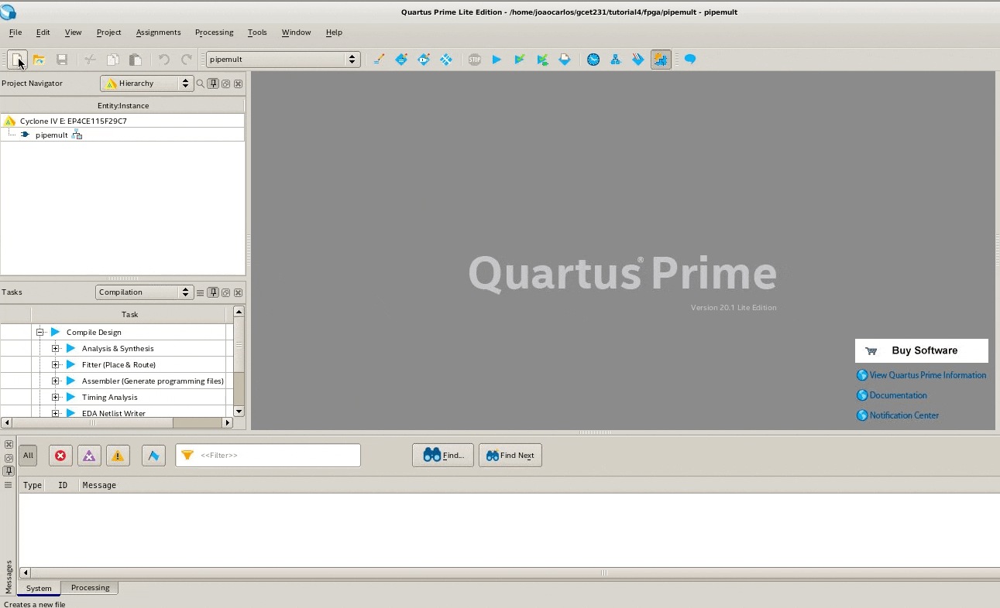

Se preferir, a medida em que for se ambientando com a ferramenta, poderá utilizar seu editor de texto preferido. Nesse caso, usar o Quartus Prime ainda será necessário para realizar a compilação, mapeamento e programação dos dispositivos FPGA.

### Arquitetura do circuito

O diagrama abaixo ilustra a estrutura do circuito que iremos desenvolver ao longo desse tutorial. O nosso circuito possui duas entradas de dados de 8 bits `dataa` e `datab`, as quais serão operadas sobre um multiplicador simples para números sem sinal. O circuito possui ainda duas entradas de endereço de memória. A entrada `wraddr` é usada para escrita, enquanto `rdaddr` é utilizada como endereço de leitura da memória. Finalmente, nosso circuito possui ainda um sinal de habilitação da escrita na memória, nomeado como `wren`.

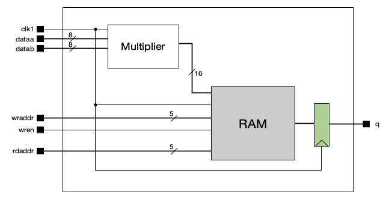

Para implementar a funcionalidade do nosso circuito nós precisamos de um multiplicador $8\times8$ e uma memória RAM $32\times16$ (32 posições de 16 bits). A saída da memória é ligada a um registrador de 16 bits, conectado ao sinal `q`, única saída do circuito proposto.

### Introdução ao Quartus Prime MegaWizard

Você também pode introduzir blocos de IP em seus projetos. Um bloco IP é uma estrutura pré-definida que pode ser personalizada dentro do Quartus Prime. Um IP pode representar qualquer componente, desde elementos de lógica simples até blocos mais complicados, como controladores DDR, memórias ou PLL. A maior parte dos IPs disponíveis no catálogo do Quartus Prime são gratuitos. Vamos criar um multiplicador personalizado a partir do catálogo de IP do Quartus Prime. Se a janela **IP catalog** não estiver visível, selecione-a no menu **Tools**, ou no menu **View**.

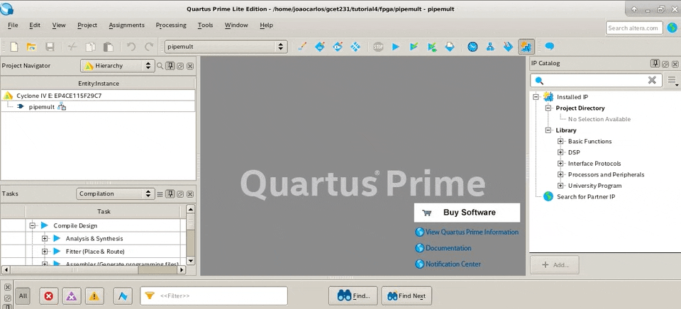

Na janela **IP Catalog**, localizada à direita da janala principal do Quartus Prime, na opção **Library**, procure por **Basic Functions** `→` **Arithmetic** e selecione o IP **LPM_MULT** clicando duas vezes no nome. Na caixa de diálogo **Save IP Variation**, exibida em seguida, especifique o nome do arquivo de variação IP como `mult`, adicionando `mult` ao final do caminho do arquivo, o qual deve corresponder ao diretório do projeto. Selecione a opção Verilog em **IP variarion file type** e pressione **OK**.

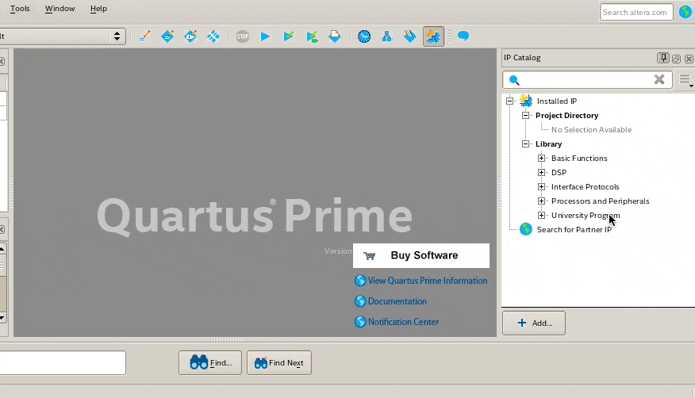

A caixa de diálogo de parâmetros MegaWizard para o multiplicador LPM deve abrir. Na primeira parte, defina a largura dos barramentos `dataa` e `datab` da memória para oito bits e mantenha os padrões para todas as outras configurações. Em seguida, clique em **Next**.

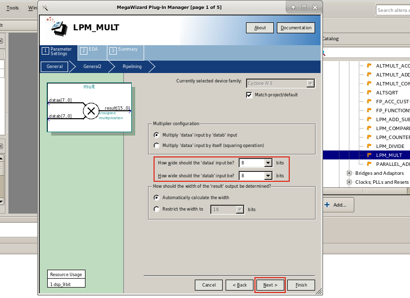

Na próxima página, note que há algumas opções de configuração importantes. A primeira delas permite que definamos um valor padrão para a entrada `datab`. Em seguida, é possível escolher entre multiplicações com números sem sinal (_unsigned_) ou com sinal (_signed_). Por último, encontramos a opção para usar elementos lógicos ou multiplicadores dedicados para implementar o nosso circuito. Vamos usar as configurações padrão do Quartus Prime. Deixe as caixas de seleção com os valores definidos e clique em **Next**.


Na próxima página, selecione a opção **Yes, I want output latency** e especifique 2 (dois) na caixa de texto **clock cycles**. Clique em **Next** para continuar. Essa configuração fará com que o Quartus Prime explore o paralelismo para acelerar a execução da operação de multiplicação. Especificamente, estamos usando os dois registradores presentes nos circuitos multiplicadores presentes dentro do dispositivo FPGA.

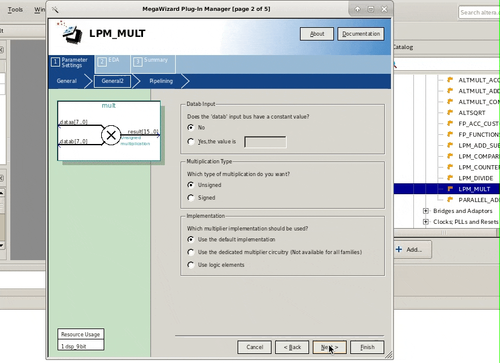

Novamente, nas configurações de EDA, clique em **Next** para continuar. Na página de resumo -- última página do MegaWizard -- certifique-se de marcar a caixa de seleção correspondente ao item `mult_inst.v`. Isso fará com que o assistente produza, entre suas saídas, um arquivo de modelo de instanciação Verilog que será útil logo mais. Clique em **Finish** para criar o seu multiplicador. Se o assistente perguntar se você deseja adicionar o arquivo IP ao projeto, clique em **Yes**.

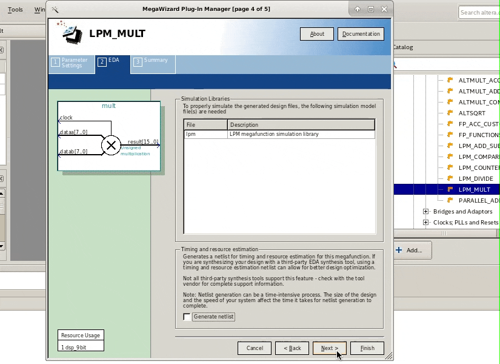

Agora, se você olhar para a guia arquivos no navegador do projeto, você deve ver um novo arquivo chamado `mult.qip` na lista de arquivos do **Project Navitator**. Clique no símbolo `+` ao lado do nome do arquivo e veja o que surge.

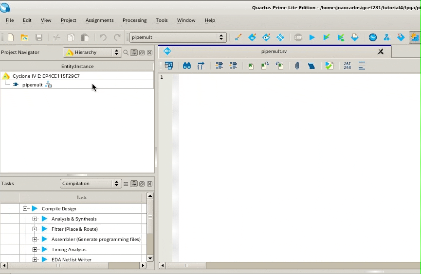

Abra o arquivo `mult.v`e note como sua estrutura é definida. Um bloco de IP é uma estrutura pré-definida presentes nas bibliotecas de síntese do dispositivo FPGA. Em geral, essas estruturas são especificadas na forma de componentes do dispositivo FPGA. Isso quer dizer que você não pode visualizar sua descrição comportamental.

```verilog
module mult (
	clock,
	dataa,
	datab,
	result);

	input	  clock;
	input	[7:0]  dataa;
	input	[7:0]  datab;
	output	[15:0]  result;

	wire [15:0] sub_wire0;
	wire [15:0] result = sub_wire0[15:0];

	lpm_mult	lpm_mult_component (
				.clock (clock),
				.dataa (dataa),
				.datab (datab),
				.result (sub_wire0),
				.aclr (1'b0),
				.clken (1'b1),
				.sclr (1'b0),
				.sum (1'b0));
	defparam
		lpm_mult_component.lpm_hint = "MAXIMIZE_SPEED=5",
		lpm_mult_component.lpm_pipeline = 2,
		lpm_mult_component.lpm_representation = "UNSIGNED",
		lpm_mult_component.lpm_type = "LPM_MULT",
		lpm_mult_component.lpm_widtha = 8,
		lpm_mult_component.lpm_widthb = 8,
		lpm_mult_component.lpm_widthp = 16;


endmodule
```

> **_Faça você mesmo:_** Analise o código acima e identifique as opções de configuração que você definiu usando o assistente MegaWizard. Essas configurações estão presentes no comando `defparam`. O que acha que acontecerá se você alterar os valores de configuração diretamente no arquivo `mult.v`?

### Criando módulo Top-Level

Agora que já temos os módulos necessários para a criação do nosso projeto vamos retornar ao nosso arquivo `pipemult.sv`. Caso o arquivo não esteja aberto, clique duas vezes em `pipemult` na janela do **Project Navigator**. Começaremos escrevendo o código que representa a interface de entrada e saída do nosso módulo `pipemult`. Copie o trecho a seguir para o arquivo `pipemult.sv` e pressione as teclas `ctrl+s` para salvar as modificações.

```verilog
module pipemult (
  input [7:0] dataa,
  input [7:0] datab,
  input clk1,
  input [4:0] wraddr,
  input [4:0] rdaddr,
  input wren,
  output [15:0] q
);

  // -------------------------------------------------------------
  // Corpo do módulo.
  // -------------------------------------------------------------
  // Insira a seguir as delarações de sinais wire e reg
  // -------------------------------------------------------------


  // -------------------------------------------------------------
  // Insira a seguir as instâncias de descrições comportamentais.
  // -------------------------------------------------------------

endmodule
```

Agora, em seu editor preferido, abra o arquivo `mult_inst.v`, copie o conteúdo e cole-o na posição indicada do arquivo `pipemult.sv`. Substitua as entradas de clock e dados de modo que elas correspondam aos sinais especificados nas entradas do módulo `pipemult`. Por enquanto, vamos deixar o sinal `result` conectado a um sinal desconhecido. Trataremos dele logo em seguida. Se necessário utilize o trecho de código à seguir.

```verilog
mult mult_inst (
   .clock ( clk1 ),
   .dataa ( dataa ),
   .datab ( datab ),
   .result ( result_sig )
);
```

Vamos fazer o mesmo para o bloco `ram.sv`. Nesse caso, como não temos um modelo de instanciação para este componente, vamos extraí-lo a partir da declaração das suas portas de entrada e saída. Antes disso, precisamos criar o sinal que fará a ligação entre o módulo `mult` e o módulo `ram`. Podemos fazer isso declarando um sinal do tipo `wire`. Usaremos o nome já definido no modelo de instanciação do módulo `mult`. Copie a declaração a seguir e cole no arquivo `pipemult.sv` na posição indicada nos comentários.

```verilog
wire [15:0] result_sig;
```

A instanciação do módulo `ram` deve se parecer com o código a seguir. Notem que usamos as entradas do módulo `pipemult` como nossas entradas de endereço de escrita (`wraddr`) e leitura (`rdaddr`), clock da memória (`clk1`), além do sinal de habilitação de escrita na memória (`wren`). Perceba ainda, que ligamos a saída do módulo multiplicador (`result`) à entrada de dados da memória (`data`) através do sinal `result_sig`. Nossa memória será configurada como uma RAM síncrona de porta única com 32 posições com 16 bits. Utilize o modelo de a seguir e posicione-o após a instanciação do módulo `mult`.

```verilog
ram #(
  .DATA_WIDTH(16),
  .ADDR_WIDTH(5)
) ram_inst (
  .data(result_sig),
  .wraddr(wraddr),
  .rdaddr(rdaddr),
  .we(wren),
  .clk(clk1),
  .q(q_sig)
);
```

Para finalizar a especificação do nosso circuito, precisamos implementar um registrador de saída da memória, assim como apresentado no diagrama da arquitetura do circuito. Para isso, crie um novo arquivo, clicando no menu **File** `→` **New** e, em seguida, escolha **SystemVerilog HDL File**. Salve-o com o nome `d_ff.sv`. Em seguira, copie o trecho de código a seguir e pressione `ctrl+s` para salvar o arquivo.

```verilog
module d_ff (
  input clk,
  input [15:0] d,
  output [15:0] q
);

  always@(posedge clk) begin
    q <= d;
  end
endmodule
```

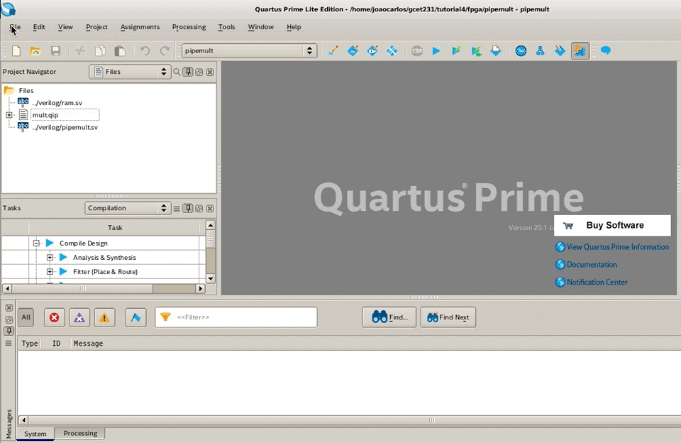

Vamos concluir a especificação HDL do nosso circuito instanciando o registrador e conectando-o à saída da memória RAM. Para isso, primeiro precisamos declarar o sinal que representa a ligação entre as instâncias dos módulos `ram` e `d_ff`. Para este propósito criaremos o sinal `q_sig`.

```verilog
wire [15:0] q_sig;
```

Agora podemos adicionar uma instância do nosso módulo `d_ff`, de acordo com o trecho de código a seguir.

```verilog
d_ff d_ff_inst (
  .clk( clk1 ),
  .d( q_sig ),
  .q( q )
);
```

Se você chegou até aqui, cumprindo todas as etapas descritas nesse tutorial, o código do módulo `pipemult` deve se parecer com o que é apresentado a seguir.

```verilog
module pipemult (
  input [7:0] dataa,
  input [7:0] datab,
  input clk1,
  input [4:0] wraddr,
  input [4:0] rdaddr,
  input wren,
  output [15:0] q
);

  // -------------------------------------------------------------
  // Corpo do módulo.
  // -------------------------------------------------------------
  wire [15:0] result_sig;
  wire [15:0] q_sig;

  mult mult_inst (
  	.clock ( clk1 ),
		.dataa ( dataa ),
		.datab ( datab ),
		.result ( result_sig )
	);

  ram #(
  	.DATA_WIDTH(16),
  	.ADDR_WIDTH(5)
  ) ram_inst (
    .data(result_sig),
    .wraddr(wraddr),
    .rdaddr(rdaddr),
    .we(wren),
    .clk(clk1),
    .q(q_sig)
  );

  d_ff d_ff_inst (
  	.clk( clk1 ),
  	.d( q_sig ),
  	.q( q )
  );

endmodule
```

Para garantir que não há erros de sintaxe ou semântica no seu código, o Quartus Prime possui uma ferramenta de análise específicamente elaborada com esse propósito. Para isso, clique no menu **Processing** e, em seguida, **Analyze Current File**. Faça isso para todos os arquivos que você criou, especialmente para o `pipemult.sv`.

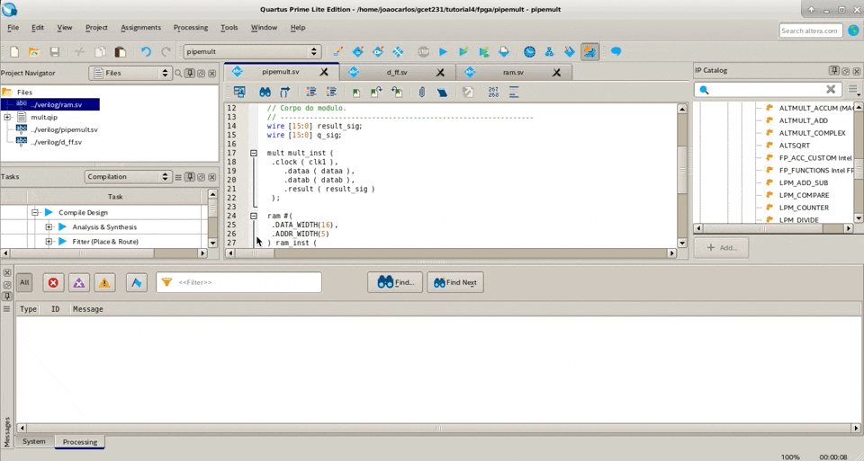

Se tudo correr como esperado, você deve visualizar um conjunto de mensagens semelhante às que são apresentadas a seguir.

```
[...]
Info: Quartus Prime Analyze Current File was successful. 0 errors, 1 warning
	Info: Peak virtual memory: 659 megabytes
	Info: Processing ended: Mon Apr 26 11:32:26 2021
	Info: Elapsed time: 00:00:07
	Info: Total CPU time (on all processors): 00:00:25
```

Se algo der errado, você verá uma mensagem de erro destacada na cor vermelha. Se esse não foi o seu caso, parabéns, você concluiu a etapa de entrada de projeto do nosso experimento e poderá seguir adiante. Caso contrário, verifique qual foi o erro encontrado e tente solucioná-lo. Se necessário retorne algumas etapas do tutorial.

## Compilando o Projeto

[TBD]

## Analise Gráfica do Circuito Através do RTL Viewer e Techonology Map Viewer

[TBD]

## Análise Temporal com TimeQuest

[TBD]

---

<a href="#top">Voltar para o início</a> | <a href="">Próximo Tutorial</a>
