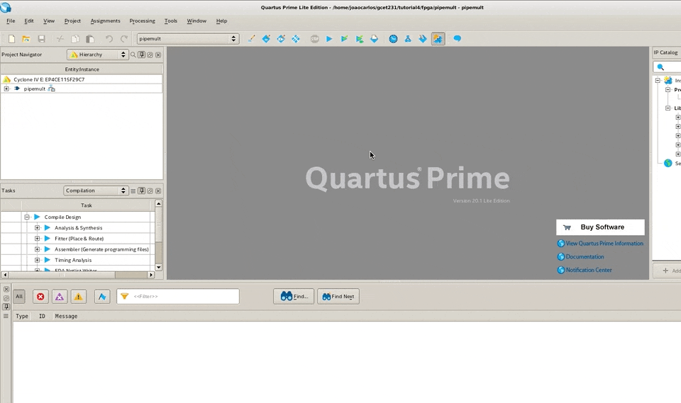
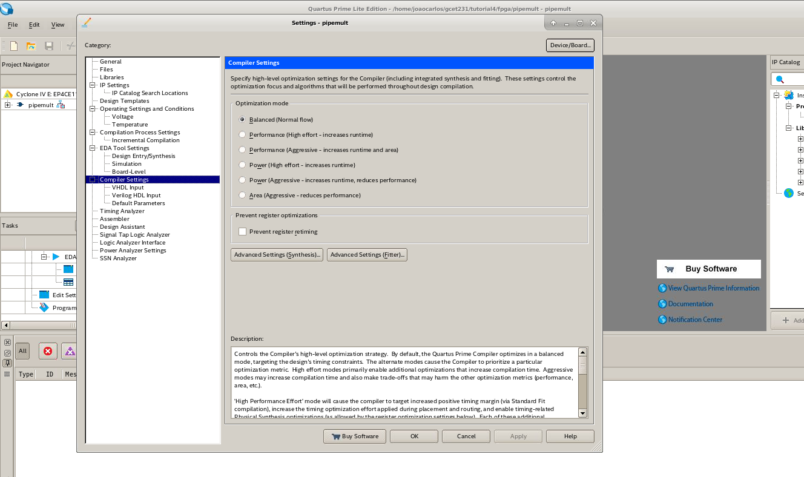
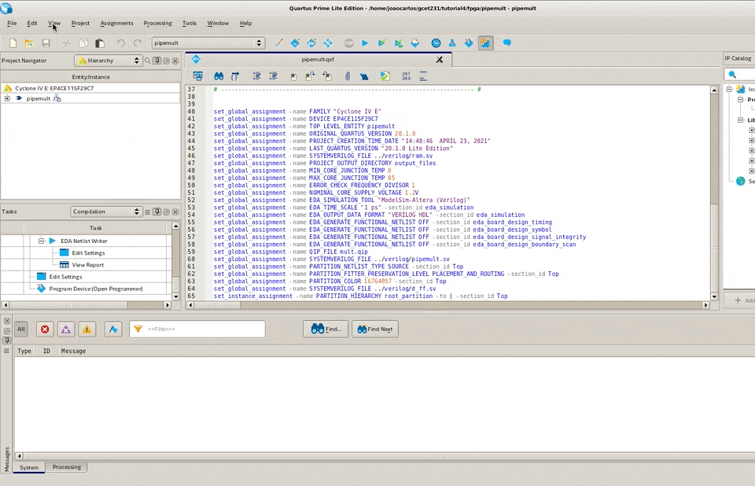
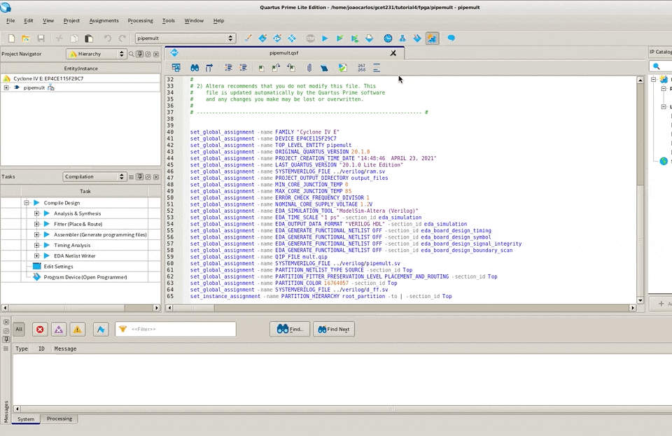
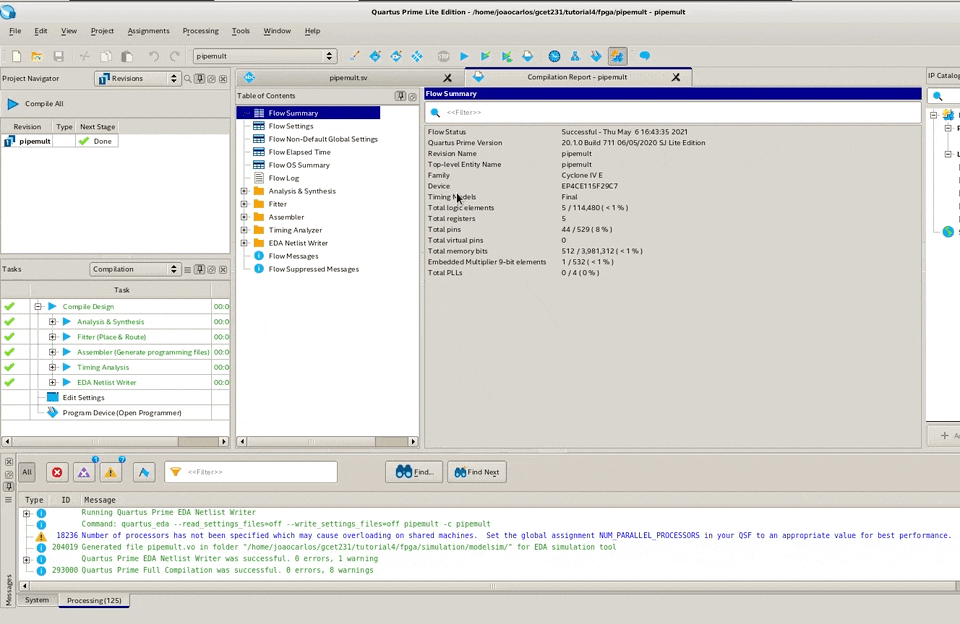
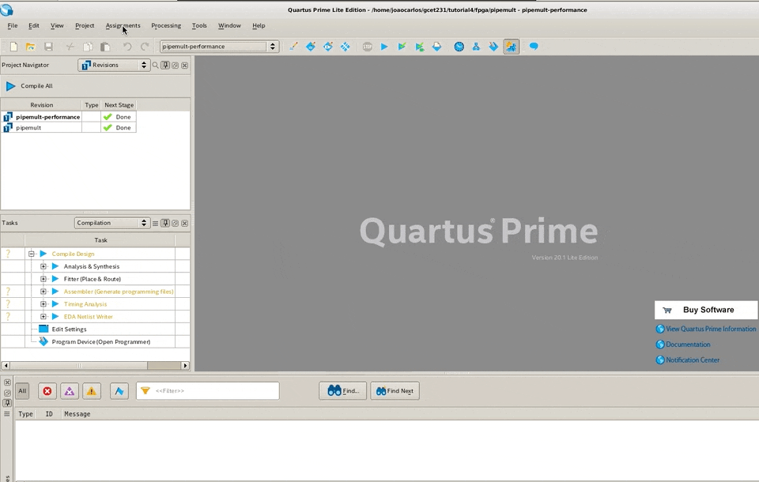
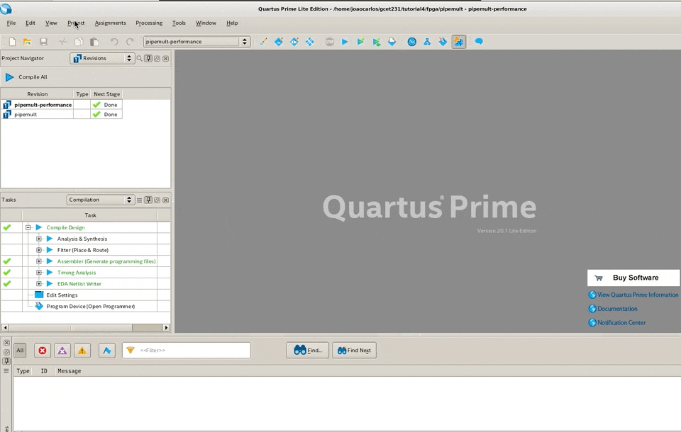

# GCET231 Tutorial 4: Criando um Projeto no Quartus Prime

- Autor: João Bittencourt
- Data: 24 de abril de 2021
- Revisão: 1.4

**Sumário**

- [Introdução][docs/pages/intro.md]
- Assistente de Criação de Projetos
- Explorando o Projeto Recém Criado
- Expandindo o Projeto Usando SystemVerilog
- Compilando o Projeto
- Analisando Graficamente o Circuito RTL
- Análise Temporal com TimeQuest

## Assistente de Criação de Projetos

Nosso objetivo neste tutorial é cumprir com todas as etapas necessárias para completar o projeto de um circuito em um dispositivo FPGA. Abra o Quartus Prime, se já não estiver aberto. A criação de um projeto é a primeira etapa para iniciar nossos projetos dentro do Quartus Prime, e o assistente **New Project Wizard** torna esse processo mais fácil pra você. Você pode acessar o **New Project Wizard** a partir da página principal do Quartus Prime, que surge assim que ele é aberto, ou selecionando o menu **File** e então **New Project Wizard**.

A primeira página desse assistente descreve as etapas de criação de um projeto. Leia com atenção os itens que estão destacados e clique em **Next**. Em seguida, nós entramos com a informação do diretório onde o projeto será criado. Nós criaremos nosso projeto dentro do diretório **fpga** que se encontra na estrutura de arquivos do repositório. Chamaremos nosso projeto de `pipemult`, o qual também será o nome da nossa módulo _top-level_ dentro da hierarquia do projeto _(falaremos mais sobre isso depois)_. Notem que o último campo será preenchido automaticamente para você.


Na tela seguinte, você deve escolher se deseja iniciar um projeto vazio, ou se prefere iniciar a partir de um modelo de projeto, para o caso em que você tenha baixado um projeto de exemplo ou estiver trabalhando com uma placa de desenvolvimento. Nesse último caso, um modelo de projeto pode ajudar uma vez que já traz todas as configurações relacionadas à pinagem de entrada e saída e demais especificações da placa de desenvolvimento (apesar de nem sempre estarem disponíveis). Para o propósito desse tutorial, vamos criar um projeto vazio.

Agora você poderá adicionar arquivos ao seu projeto. No diretório `verilog`, vocês vão encontrar o nosso arquivo de exemplo. Adicione apenas o arquivo `ram.sv` clicando nos três pontos para navegar até a paster `verilog`, diretório onde serão armazenados todos os nossos arquivos SystemVerilog.


Na próxima página, você deve selecionar o dispositivo FPGA que irá programar. Você pode selecionar a família do dispositivo e sua categoria. Além disso é possível ainda filtrar por tipo de encapsulamento (_Package_), quantidade de pinos (_Pin count_), ou _Core speed grade_. Você também pode buscar por um dispositivo informando o nome do impresso no encapsulamento do dispositivo FPGA. Além disso, você pode escolher o dispositivo FPGA de acordo com uma determinada placa de desenvolvimento, clicando na aba **Board**. Vamos selecionar o _chip_ que compõe a plataforma de desenvolvimento [Terasic DE2-115](http://www.terasic.com.tw/cgi-bin/page/archive.pl?Language=English&CategoryNo=139&No=502), usada nos laboratórios de GCET231. Para isso, na janela **Family, Device & Board Settings**, escolha a família `Cyclone IV E` e o dispositivo `EP4CE115F29C7`. Em seguida, clique em **Next**.


Na próxima página, você pode escolher as ferramentas e configuração para a simulação, síntese a análise do projeto. Essas ferramentas podem ser adicionadas ou modificadas depois que seu projeto estiver criado. Por enquanto vamos manter as configurações padrão da ferramenta e seguir adiante, clicando em **Next**. A página final do assistente apresenta um resumo de todas as configurações definidas por você. Tire um tempo para analisar as suas configurações e então clique em **Finish** para criar seu projeto.

## Explorando o Projeto Recém Criado

O único arquivo que você deve visualizar em seu projeto é aquele que adicionamos anteriormente (`ram.sv`). Entretanto, o Quartus Prime criou para você, dentro da pasta do projeto (`fpga`), um arquivo `.qpf` (**Quartus Project File**), usado para abrir o projeto. Além disso, o Quartus Prime criou também um arquivo `.qsf` (**Quartus Settings File**), o qual armazena todas as configurações de projeto e atribuições a pinos de entrada e saída.


Os arquivos com a extensão `.qsf` utilizam comandos na linguagem **Tcl** (pronuncia-se _tickle_) para configurar os projetos do Quartus Prime. Nesse arquivo você encontrará todas as configurações implementadas a partir da interface gráfica, em especial, aquelas que relacionam os pinos do FPGA com as portas de entrada e saída do seu circuito.

> **_Faça você mesmo:_** analise o código abaixo e tente identificar os elementos de configuração que você definiu usando o **New Project Wizard**. Observe cada linha de código para entender a sintaxe Tcl utilizada pelo Quartus Prime.

```tcl
set_global_assignment -name FAMILY "Cyclone IV E"
set_global_assignment -name DEVICE EP4CE115F29C7
set_global_assignment -name TOP_LEVEL_ENTITY pipemult
set_global_assignment -name ORIGINAL_QUARTUS_VERSION 20.1.0
set_global_assignment -name PROJECT_CREATION_TIME_DATE "14:48:46  APRIL 23, 2021"
set_global_assignment -name LAST_QUARTUS_VERSION "20.1.0 Lite Edition"
set_global_assignment -name SYSTEMVERILOG_FILE ../verilog/ram.sv
set_global_assignment -name PROJECT_OUTPUT_DIRECTORY output_files
```

O nome do projeto, definido na primeira etapa da criação do projeto, é exibido na barra de título superior do Quartus Prime. O módulo _top-level_ do projeto, por sua vez, aparece na guia **Hierarchy**, da janela **Project Navigator**.


Clique duas vezes no arquivo `ram.sv` para abri-lo no editor de texto do Quartus Prime. Caso não esteja visualizando o arquivo, na janela **Project Navigator**, escolha **File** na caixa de seleção. Por enquanto, você não precisa se preocupar com o funcionamento desse código aberto no editor de arquivos de texto. O editor de texto do Quartus Prime é um bom editor para códigos HDL. Ele possui numeração de linha, reconhecimento de sintaxe, além da possibilitar a inserção de modelos de função HDL, TCL ou mega-funções nos arquivos através de modelos.


Use o botão **Insert template** para inserir modelos de funções e comandos nos arquivos de projeto. Explore as opções de modelo pois elas poderão ser úteis no futuro. Alguns exemplos interessantes de serem analisados são apresentadas a seguir.

- Verilog HDL `→` Full Designs `→` RAMs and ROMs
- Verilog HDL `→` Full Designs `→` State Machines
- Verilog HDL `→` Constructs `→` Sequential Statements


> _**Faça você mesmo:**_ explore a janela **Insert Template** e procure por modelos de implementação de funções básicas como declaração de sinais, DFF, Mutliplexadores, Memórias, etc. Faça isso tanto para os modelos nas linguagens Verilog HDL, SystemVerilog HDL e VHDL.

## Expandindo o Projeto usando SystemVerilog

Na criação de projetos FPGA no Quartus Prime, é possível utilizar diversos métodos, incluindo a importação de blocos IP, HDL (Verilog, SystemVerilog e VHDL), entrada de máquina de estado e importação de arquivos EDIF. Vamos agora demonstrar como selecionar um desses métodos no desenvolvimento de um projeto digital. Para concluir essa etapa, apesar de não ser fundamental, é importante que você tenha concluído o tutorial sobre Verilog uma vez que não é nosso objetivo aqui explicar os comandos a medida em que eles são apresentados.

### Criando um novo arquivo

Para criar um novo arquivo, clicamos no menu **File** e então **New File...**. O Quartus Prime suporta vários formatos de arquivo diferentes para entrada de arquivos. Para entradas baseadas em código, usando HDL, ele suporta todos os padrões VHDL ou Verilog e grande parte das extensões SystemVerilog. Para entrada baseada em esquema, ele inclui um editor esquemático que pode ser usado para criar diagramas de blocos ou diagramas de circuitos. Você pode ainda criar máquinas de estado usando o editor de máquina de estado. O Quartus Prime também inclui também um editor de memória para criar arquivos hexadecimais padrão Intel, ou Memory Initialization Files (MIF) para inicializar RAMs ou ROMs em seu projeto. Você também pode importar arquivos EDIF de ferramentas de terceiros e do Quartus Prime. Ao longo deste tutorial, utilizamos apenas entradas a partir de arquivos de código Verilog e SystemVerilog.

Vamos criar um novo arquivo no formato SystemVerilog HDL. Para isso, nós devemos selecionar a opção **SystemVerilog HDL File** na caixa de diálogo de criação de novo arquivo, e em seguida clicar em **OK**. Em seguida, salve o novo arquivo clicando no menu **File** e em seguida **Save as...** Certifique-se de escolher o diretório `verilog` como destino e salve o arquivo com o nome `pipemult.sv`, se o nome já não tiver sido preenchido para você. Esse será usado para especificar nosso componente _top-level_. Falaremos sobre ele logo mais adiante neste tutorial. Nós criaremos todo o nosso circuito usando o editor de código incluído no Quartus Prime. Com esse editor você pode tirar proveito de todos os recursos das linguagens HDL.


Se preferir, a medida em que for se ambientando com a ferramenta, poderá utilizar seu editor de texto preferido. Nesse caso, usar o Quartus Prime ainda será necessário para realizar a compilação, mapeamento e programação dos dispositivos FPGA.

### Arquitetura do circuito

O diagrama abaixo ilustra a estrutura do circuito que iremos desenvolver ao longo desse tutorial. O nosso circuito possui duas entradas de dados de 8 bits `dataa` e `datab`, as quais serão operadas sobre um multiplicador simples para números sem sinal. O circuito possui ainda duas entradas de endereço de memória. A entrada `wraddr` é usada para escrita, enquanto `rdaddr` é utilizada como endereço de leitura da memória. Finalmente, nosso circuito possui ainda um sinal de habilitação da escrita na memória, nomeado como `wren`.


Para implementar a funcionalidade do nosso circuito nós precisamos de um multiplicador $8\times8$ e uma memória RAM $32\times16$ (32 posições de 16 bits). A saída da memória é ligada a um registrador de 16 bits, conectado ao sinal `q`, única saída do circuito proposto.

### Introdução ao Quartus Prime MegaWizard

Você também pode introduzir blocos de IP em seus projetos. Um bloco IP é uma estrutura pré-definida que pode ser personalizada dentro do Quartus Prime. Um IP pode representar qualquer componente, desde elementos de lógica simples até blocos mais complicados, como controladores DDR, memórias ou PLL. A maior parte dos IPs disponíveis no catálogo do Quartus Prime são gratuitos. Vamos criar um multiplicador personalizado a partir do catálogo de IP do Quartus Prime. Se a janela **IP catalog** não estiver visível, selecione-a no menu **Tools**, ou no menu **View**.


Na janela **IP Catalog**, localizada à direita da janala principal do Quartus Prime, na opção **Library**, procure por **Basic Functions** `→` **Arithmetic** e selecione o IP **LPM_MULT** clicando duas vezes no nome. Na caixa de diálogo **Save IP Variation**, exibida em seguida, especifique o nome do arquivo de variação IP como `mult`, adicionando `mult` ao final do caminho do arquivo, o qual deve corresponder ao diretório do projeto. Selecione a opção Verilog em **IP variarion file type** e pressione **OK**.


A caixa de diálogo de parâmetros MegaWizard para o multiplicador LPM deve abrir. Na primeira parte, defina a largura dos barramentos `dataa` e `datab` da memória para oito bits e mantenha os padrões para todas as outras configurações. Em seguida, clique em **Next**.


Na próxima página, note que há algumas opções de configuração importantes. A primeira delas permite que definamos um valor padrão para a entrada `datab`. Em seguida, é possível escolher entre multiplicações com números sem sinal (_unsigned_) ou com sinal (_signed_). Por último, encontramos a opção para usar elementos lógicos ou multiplicadores dedicados para implementar o nosso circuito. Vamos usar as configurações padrão do Quartus Prime. Deixe as caixas de seleção com os valores definidos e clique em **Next**.


Na próxima página, selecione a opção **Yes, I want output latency** e especifique 2 (dois) na caixa de texto **clock cycles**. Clique em **Next** para continuar. Essa configuração fará com que o Quartus Prime explore o paralelismo para acelerar a execução da operação de multiplicação. Especificamente, estamos usando os dois registradores presentes nos circuitos multiplicadores presentes dentro do dispositivo FPGA.


Novamente, nas configurações de EDA, clique em **Next** para continuar. Na página de resumo -- última página do MegaWizard -- certifique-se de marcar a caixa de seleção correspondente ao item `mult_inst.v`. Isso fará com que o assistente produza, entre suas saídas, um arquivo de modelo de instanciação Verilog que será útil logo mais. Clique em **Finish** para criar o seu multiplicador. Se o assistente perguntar se você deseja adicionar o arquivo IP ao projeto, clique em **Yes**.


Agora, se você olhar para a guia arquivos no navegador do projeto, você deve ver um novo arquivo chamado `mult.qip` na lista de arquivos do **Project Navitator**. Clique no símbolo `+` ao lado do nome do arquivo e veja o que surge.


Abra o arquivo `mult.v`e note como sua estrutura é definida. Um bloco de IP é uma estrutura pré-definida presentes nas bibliotecas de síntese do dispositivo FPGA. Em geral, essas estruturas são especificadas na forma de componentes do dispositivo FPGA. Isso quer dizer que você não pode visualizar sua descrição comportamental.

```verilog
module mult (
	clock,
	dataa,
	datab,
	result);

	input	  clock;
	input	[7:0]  dataa;
	input	[7:0]  datab;
	output	[15:0]  result;

	wire [15:0] sub_wire0;
	wire [15:0] result = sub_wire0[15:0];

	lpm_mult	lpm_mult_component (
				.clock (clock),
				.dataa (dataa),
				.datab (datab),
				.result (sub_wire0),
				.aclr (1'b0),
				.clken (1'b1),
				.sclr (1'b0),
				.sum (1'b0));
	defparam
		lpm_mult_component.lpm_hint = "MAXIMIZE_SPEED=5",
		lpm_mult_component.lpm_pipeline = 2,
		lpm_mult_component.lpm_representation = "UNSIGNED",
		lpm_mult_component.lpm_type = "LPM_MULT",
		lpm_mult_component.lpm_widtha = 8,
		lpm_mult_component.lpm_widthb = 8,
		lpm_mult_component.lpm_widthp = 16;


endmodule
```

> **_Faça você mesmo:_** Analise o código acima e identifique as opções de configuração que você definiu usando o assistente MegaWizard. Essas configurações estão presentes no comando `defparam`. O que acha que acontecerá se você alterar os valores de configuração diretamente no arquivo `mult.v`?

### Criando módulo Top-Level

Agora que já temos os módulos necessários para a criação do nosso projeto vamos retornar ao nosso arquivo `pipemult.sv`. Caso o arquivo não esteja aberto, clique duas vezes em `pipemult` na janela do **Project Navigator**. Começaremos escrevendo o código que representa a interface de entrada e saída do nosso módulo `pipemult`. Copie o trecho a seguir para o arquivo `pipemult.sv` e pressione as teclas `ctrl+s` para salvar as modificações.

```verilog
module pipemult (
  input [7:0] dataa,
  input [7:0] datab,
  input clk1,
  input [4:0] wraddr,
  input [4:0] rdaddr,
  input wren,
  output [15:0] q
);

  // -------------------------------------------------------------
  // Corpo do módulo.
  // -------------------------------------------------------------
  // Insira a seguir as delarações de sinais wire e reg
  // -------------------------------------------------------------


  // -------------------------------------------------------------
  // Insira a seguir as instâncias de descrições comportamentais.
  // -------------------------------------------------------------

endmodule
```

Agora, em seu editor preferido, abra o arquivo `mult_inst.v`, copie o conteúdo e cole-o na posição indicada do arquivo `pipemult.sv`. Substitua as entradas de clock e dados de modo que elas correspondam aos sinais especificados nas entradas do módulo `pipemult`. Por enquanto, vamos deixar o sinal `result` conectado a um sinal desconhecido. Trataremos dele logo em seguida. Se necessário utilize o trecho de código à seguir.

```verilog
mult mult_inst (
   .clock ( clk1 ),
   .dataa ( dataa ),
   .datab ( datab ),
   .result ( result_sig )
);
```

Vamos fazer o mesmo para o bloco `ram.sv`. Nesse caso, como não temos um modelo de instanciação para este componente, vamos extraí-lo a partir da declaração das suas portas de entrada e saída. Antes disso, precisamos criar o sinal que fará a ligação entre o módulo `mult` e o módulo `ram`. Podemos fazer isso declarando um sinal do tipo `wire`. Usaremos o nome já definido no modelo de instanciação do módulo `mult`. Copie a declaração a seguir e cole no arquivo `pipemult.sv` na posição indicada nos comentários.

```verilog
wire [15:0] result_sig;
```

A instanciação do módulo `ram` deve se parecer com o código a seguir. Notem que usamos as entradas do módulo `pipemult` como nossas entradas de endereço de escrita (`wraddr`) e leitura (`rdaddr`), clock da memória (`clk1`), além do sinal de habilitação de escrita na memória (`wren`). Perceba ainda, que ligamos a saída do módulo multiplicador (`result`) à entrada de dados da memória (`data`) através do sinal `result_sig`. Nossa memória será configurada como uma RAM síncrona de porta única com 32 posições com 16 bits. Utilize o modelo de a seguir e posicione-o após a instanciação do módulo `mult`.

```verilog
ram #(
  .DATA_WIDTH(16),
  .ADDR_WIDTH(5)
) ram_inst (
  .data(result_sig),
  .wraddr(wraddr),
  .rdaddr(rdaddr),
  .we(wren),
  .clk(clk1),
  .q(q_sig)
);
```

Para finalizar a especificação do nosso circuito, precisamos implementar um registrador de saída da memória, assim como apresentado no diagrama da arquitetura do circuito. Para isso, crie um novo arquivo, clicando no menu **File** `→` **New** e, em seguida, escolha **SystemVerilog HDL File**. Salve-o com o nome `d_ff.sv`. Em seguira, copie o trecho de código a seguir e pressione `ctrl+s` para salvar o arquivo.

```verilog
module d_ff (
  input clk,
  input [15:0] d,
  output reg [15:0] q
);

  always@(posedge clk) begin
    q <= d;
  end
endmodule
```


Vamos concluir a especificação HDL do nosso circuito instanciando o registrador e conectando-o à saída da memória RAM. Para isso, primeiro precisamos declarar o sinal que representa a ligação entre as instâncias dos módulos `ram` e `d_ff`. Para este propósito criaremos o sinal `q_sig`.

```verilog
wire [15:0] q_sig;
```

Agora podemos adicionar uma instância do nosso módulo `d_ff`, de acordo com o trecho de código a seguir.

```verilog
d_ff d_ff_inst (
  .clk( clk1 ),
  .d( q_sig ),
  .q( q )
);
```

Se você chegou até aqui, cumprindo todas as etapas descritas nesse tutorial, o código do módulo `pipemult` deve se parecer com o que é apresentado a seguir.

```verilog
module pipemult (
  input [7:0] dataa,
  input [7:0] datab,
  input clk1,
  input [4:0] wraddr,
  input [4:0] rdaddr,
  input wren,
  output [15:0] q
);

  // -------------------------------------------------------------
  // Corpo do módulo.
  // -------------------------------------------------------------
  wire [15:0] result_sig;
  wire [15:0] q_sig;

  mult mult_inst (
  	.clock ( clk1 ),
		.dataa ( dataa ),
		.datab ( datab ),
		.result ( result_sig )
	);

  ram #(
  	.DATA_WIDTH(16),
  	.ADDR_WIDTH(5)
  ) ram_inst (
    .data(result_sig),
    .wraddr(wraddr),
    .rdaddr(rdaddr),
    .we(wren),
    .clk(clk1),
    .q(q_sig)
  );

  d_ff d_ff_inst (
  	.clk( clk1 ),
  	.d( q_sig ),
  	.q( q )
  );

endmodule
```

Para garantir que não há erros de sintaxe ou semântica no seu código, o Quartus Prime possui uma ferramenta de análise específicamente elaborada com esse propósito. Para isso, clique no menu **Processing** e, em seguida, **Analyze Current File**. Faça isso para todos os arquivos que você criou, especialmente para o `pipemult.sv`.


Se tudo correr como esperado, você deve visualizar um conjunto de mensagens semelhante às que são apresentadas a seguir.

```
[...]
Info: Quartus Prime Analyze Current File was successful. 0 errors, 1 warning
	Info: Peak virtual memory: 659 megabytes
	Info: Processing ended: Mon Apr 26 11:32:26 2021
	Info: Elapsed time: 00:00:07
	Info: Total CPU time (on all processors): 00:00:25
```

Se algo der errado, você verá uma mensagem de erro destacada na cor vermelha. Se esse não foi o seu caso, parabéns, você concluiu a etapa de entrada de projeto do nosso experimento e poderá seguir adiante. Caso contrário, verifique qual foi o erro encontrado e tente solucioná-lo. Se necessário retorne algumas etapas do tutorial.

## Compilando o Projeto

Nessa parte do tutorial, você compilará o seu projeto FPGA utilizando o Quartus Prime. O Quartus Prime possui um conjunto de módulos de software responsáveis por realizar a síntese, mapeamento, montagem e análise do circuito, gerar arquivos de saída de programação. As etapas de compilação podem ser executadas de uma só vez ou por partes independentes. Os resultados de síntese, por sua vez podem ser otimizados por meio das configurações do compilador. Além disso, o Quartus Prime também gera relatórios para análise.

Você pode executar todas as etapas no fluxo de compilação de uma só vez, ou separadamente. No Quartus Prime, é possível instruir o compilador a aplicar um vasto conjunto de técnicas, tais como a compilação orientada ao tempo de atraso, que pode otimizar os recursos do dispositivo e reduzir o caminho crítico do seu circuito.

Muitos dos comandos associados ao compilador do Quartus Prime estão no menu **Processing**. Você pode executar todo o processo de compilação de uma só vez clicando em **Start Compilation** ou clicando no ícone de triângulo na barra de ferramentas. Você também pode executar as ferramentas de compilação uma de cada vez, usando seus comandos individuais, no menu **Processing** ou diretamente na janela **Tasks**.



A ferramenta de **Analysis & Synthesis** de compiladores verifica a sintaxe dos arquivos do projeto em busca de erros, constrói um banco de dados que organiza todos os arquivos de acordo com a hierarquia e, em seguida, sintetiza e otimiza o projeto lógico e mapeia a lógica do circuito para os recursos do dispositivo. A ferramenta de **Fitting** é responsável por determinar a localização de cada componente dentro da estrutura do dispositivo FPGA e cria as rotas entre os elementos lógicos. A ferramenta **Assembler** conclui o processamento do projeto ajustando as células lógicas, atribuições de pinos e rotas em uma imagem de programação do dispositivo na forma de um ou mais arquivos de configuração. O analisador de temporização estático (**Timing Analysis**) analisa e valida o desempenho e as restrições de temporização do projeto. Você primeiro deve completar a síntese e o _fitting_ antes de poder executar a análise de tempo completa. No entanto, você pode realizar estimativas antecipadas de tempo antes do _fitting_ para ajudar a determinar algumas restrições. O **EDA Netlist Writer** gera _netlists_ para uso por ferramentas EDA. Trata-se de um arquivo fonte composto por uma lista de todas as instâncias de componentes primitivas (LEs, LABs, etc.) no circuito, além das definições sobre como eles estão conectados. Associando essa descrição às bibliotecas específicas do dispositivo, é possível realizar simulações mais precisas.


O Quartus Prime também possui um fluxo de compilação incremental que permite apenas compilar partes do circuito, o que, muitas vezes pode resultar na redução do tempo de compilação.

Vamos agora preparar o projeto `pipemult` para realizarmos uma compilação completa usando comandos encontrados no menu **Assignments**. Clique em **Device** para verificar as configurações do dispositivo. Essa janela permite que você especifique ou altere o dispositivo de destino como você fez no _New project wizard_. Nós não queremos alterar nada nesta opção, por isso, clique em **Cancel**.


Em seguida, com a caixa de diálogo **Settings**, podemos controlar o processamento de compilação. Clique em **Setting** no menu **Assignments**. A página **Compilation Process Settings** permite que você defina opções que afetam o tempo de compilação, incluindo o número de processadores a serem usados e quais ferramentas são executadas em uma compilação completa.


A parte mais importante, entretanto é a página configurações do compilador (**Compiler Settings**), o qual permite controlar o processo de _fitting_. Aqui você pode escolher entre uma abordagem equilibrada (**Balanced**) ou ter o compilador otimizado para desempenho (**Performance**), quando o objetivo é aumentar a velocidade. É possível ainda orientar o processo para reduzir o consumo de energia (**Power**), ou para a área (**Área**) para reduzir a quantidade de uso de elementos lógicos. Por enquanto, vamos deixar a configuração no método equilibrado (**Balanced**).



As configurações também podem ser modificadas por meio do uso de _scripts_. Vamos dar uma nova olhada no aquivo `pipemult.qsf`. No menu **File**, selecione **Open**, altere o tipo de arquivo **All files**, selecione o aquivo `pipemult.qsf` e clique em **Open**.


Como vimos anteriormente, aqui você encontrará os comandos Tcl que controlam todas as configurações do compilador. Quando você insere configurações da interface GUI ou digitando comandos Tcl em um console Tcl do Quartus, essas configurações são também armazenadas no arquivo `.qsf` do projeto.

Aponte para a opção **Utility Windows** no menu **View** e clique em **Tcl Console** para abrir o terminal Tcl. Qualquer dos comandos listados no arquivo `pipemult.qsf` poderia ter sido inserido aqui. Uma coisa importante de se destacar é o fato de que o Quartus Prime pode ser inteiramente controlado a partir da linha de comando Tcl.



Agora, vamos compilar o nosso projeto. Feche o arquivo `pipemult.qsf` clicando no `x` no canto superior direito da aba de arquivos do Quartus Prime. Clique duas vezes em `pipemult` na hierarquia do _Project Navigator_ e o código fonte deve aparecer se ele ainda não estiver aberto. No menu **Processing**, selecione **Start Compilation**. Isto irá executar uma compilação completa e pode levar de alguns segundos a vários minutos, dependendo do poder de processamento do seu computador.



Observe que o progresso da compilação é exibido na janela **Task** e as mensagens de sistema e de processamento aparecem automaticamente na janela Messages, localizada na parte inferior da janela do Quartus Prime. Além disso, observe que os resultados da compilação são exibidos na janela de **Compilation Report**.

À medida em que cada etapa é concluída com sucesso, você perceberá uma marca de seleção verde reconfortante ao lado de cada etapa do processo na janela de tarefas. Se forem encontrados erros, a etapa será de cor vermelha.

Ao final da compilação, podemos visualizar uma representação dos arquivos de hierarquia do projeto e os componentes na janela **Project Navigator**. Vamos agora explorar o que podemos fazer a partir desta janela. A hierarquia inteira do projeto é exibida uma vez que o projeto é analisado. Pelo menos após a etapa de análise e elaboração (Analysis & Elaboration), que corresponde ao primeiro passo da síntese do circuito. O projeto é composto por um módulo de nível superior e quaisquer outros arquivos ou módulos que são referenciados pelo nível superior, ou por qualquer outro arquivo na hierarquia. Clique com o botão direito do mouse para localizar a módulo em outras ferramentas no Quartus Prime. Esse processo também é conhecido como cross probing (ou depuração cruzada).


Ainda na janela **Project Navigator**, também podemos ver todos os arquivos no design, os módulos que compõem o projeto, uma lista de componentes IP, onde encontraremos nosso multiplicador, e por último uma lista de revisões. Notem que, atualmente, há apenas uma revisão. A seguir, você aprenderá a fazer pequenas alterações e criar novas revisões.


O relatório de compilação fornece informações detalhadas sobre a compilação atual. Quando é aberto pela primeira vez, o relatório **Flow Summary** fornece informações sobre a situação final da compilação, as revisões atuais e a versão do Quartus Prime, o nome da entidade _top-level_, o dispositivo de destino atual e o número total de células lógicas, pinos, memória, multiplicadores e PLLs usado no dispositivo.


Outros relatórios de compilação fornecem informações sobre os demais aspectos resultantes do processo de compilação, incluindo o uso de recursos do dispositivo e informações detalhadas de temporização. Você pode selecionar o relatório que deseja exibir no painel à esquerda da janela **Compilation Report**.



> **_Faça você mesmo:_** clique na opção do relatório Timequest Time Analyser. Em seguida, clique no modelo Slow 1200mv 85C e depois em Fmax Summary. Essa informação representa a frequência máxima que o clock pode operar neste circuito sob estas condições específicas. Slow, significa o resultado mais lento das estatísticas de temporização características para o dispositivo, 1.200 milivolts, corresponde à tensão do circuito e 85C, representa a temperatura de operação.
> Qual foi a frequência máxima (Fmax) que você encontrou?
> Agora clique no modelo Slow 1200mv 0C e verifique o valor da frequência máxima. O resultado é consistente com o que nós sabemos sobre o desempenho de circuitos baseados em semicondutores?

A informações sobre a frequência máxima de operação de um circuito é uma métrica crítica usada para avaliar o desempenho do FPGA e é determinada pela ferramenta de análise temporal. Por vezes, essa é uma etapa que exige tempo e esforço dos projetistas.

Você também pode querer examinar os relatórios para os tempo de _setup_ e _hold_ do circuito, clicando em **Setup Summary** ou **Hold Summary**. O valor de _slack_ corresponde à margem de tempo que o dispositivo possui para o parâmetro de temporização indicado. Valores de slack positivos indicam que as restrições de tempo foram atendidas, enquanto valores negativos indicam que houve uma violação, e serão destacados em vermelho quando ocorrerem. Você analisará o seu circuito no analisador de temporização mais adiante.

O Quartus Prime permite experimentar as configurações do compilador e as regras de projeto, também conhecidas como _design constrains_ utilizando revisões para comparar resultados de compilação. Na janela **Project Navigator**, clique na guia direita e selecione **Revisions** . Quando criamos uma revisão, o Quartus Prime cria um arquivo de configuração `.qsf` separado, o qual contém todas as configurações e atribuições relacionadas a essa revisão e coloca-o no nível superior para o projeto.


A caixa de diálogo de revisões permite que você selecione uma revisão para o projeto atual e, em seguida, faça edições nela. Uma marca de seleção ou um nome de revisão em negrito indica a revisão atual. Para abrir a caixa de diálogo de revisões, clique em **Revisions** no menu **Project**. Para criar uma nova revisão com base em uma já existente, fazemos duplo clique em _new revision_ na caixa de diálogo **Revisions**. Na caixa de diálogo **Create Revision**, digite `pipemult-performance` para o nome da revisão, selecione `pipemult` como a referência a qual queremos basear a nova revisão e, em seguida, clique em **OK** para fechar a caixa de diálogo.


Pode levar um minuto ou mais para que a nova revisão seja efetivamente criada. Vamos agora alterar a forma como esta revisão do nosso projeto é compilada de modo a otimizar o desempenho do circuito. No menu de **Assignments**, clique em **Settings**. Nas configurações de compilação (Compilation Settings), altere a configuração de _Balanced_ para _Agressive Performance_. Clique em **Apply** e depois em **OK** para concluir a alteração.



De volta ao **Project Navigator**, clique em **Compile All** e aguarda. Esse processo levará algum tempo, pois ambas as revisões são compiladas. Alternativamente, você pode compilar apenas a nova revisão do projeto clicando com o botão direito do mouse na nova revisão.


Ao final do processo você deve ser capaz de visualizar o a janela de **Summary Report** referente à revisão `pipemult-performance`. Caso contrário, clique com o botão direito do mouse em `pipemult-performance` no **Project Navigator** e defina-o como a revisão atual, clicando em **Set Current Revision**.


Expanda o relatório do analisador de tempo (**TimeQuest Timing Analyzer**) e analise os parâmetros de `Fmax` de cada modelo como fizemos na revisão anterior. Você deve notar que o `Fmax` aumentou em relação à revisão original como nós poderíamos esperar. Para comparar as revisões, no menu **Project** selecione **Revisions** e clique em **Comparar**. A caixa de diálogo **Compare Revisions** deve aparecer. Clique na guia **Results** se ele ainda não estiver selecionado, e clique em cada cabeçalho para expandi-lo.


> **_Faça você mesmo:_** exporte os resultados para um arquivo de planilha na extensão .csv e analise-o em detalhes. O que mudou de uma revisão para outra?

Feche a janela **Compare Revisions** clicando em **Close**. Agora, salve o projeto clicando em **Save Project** no menu **File**. Vamos também salvar o que fizemos até agora em nosso arquivo, o que permite comprime o projeto para economizar espaço, possibilitando que ele seja compartilhado com colegas e equipe técnica com maior facilidade.

Para criar arquivar o seu projeto, no menu **Project** selecione **Archive Project** ou clique duas vezes em **Archive Project** na janela **Tasks**. Se você não vir essa informação na janela **Tasks**, defina a guia na janela como **Full Design**. A caixa de diálogo **Archive Project** deve ser exibida para você. Selecione a caixa **Archive all revisions** e, em seguida, clique em **Archive**.



Se você olhar agora no diretório do projeto, você verá que o arquivo `pipemult.qar` foi criado. Para restaurar um projeto, a partir do menu **Project**, selecione **Restore Archived Project**.

Em resumo, o Quartus Prime apresenta os recursos de gerenciamento de projetos e controles de compilação para ajudar seu projeto a ser bem-sucedido. Com essa parte do tutorial, você aprendeu a especificar as configurações do compilador para obter os resultados desejados; como executar a compilação completa; como analisar os resultados da compilação; como criar uma revisão do seu projeto; e como arquivar um projeto.

## Analise Gráfica do Circuito Através do RTL Viewer e Techonology Map Viewer

[TBD]

## Análise Temporal com TimeQuest

[TBD]

---

<a href="#top">Voltar para o início</a>
