## Compilando o Projeto

Nessa parte do tutorial, você compilará o seu projeto FPGA utilizando o Quartus Prime. O Quartus Prime possui um conjunto de módulos de software responsáveis por realizar a síntese, mapeamento, montagem e análise do circuito, gerar arquivos de saída de programação. As etapas de compilação podem ser executadas de uma só vez ou por partes independentes. Os resultados de síntese, por sua vez podem ser otimizados por meio das configurações do compilador. Além disso, o Quartus Prime também gera relatórios para análise.

Você pode executar todas as etapas no fluxo de compilação de uma só vez, ou separadamente. No Quartus Prime, é possível instruir o compilador a aplicar um vasto conjunto de técnicas, tais como a compilação orientada ao tempo de atraso, que pode otimizar os recursos do dispositivo e reduzir o caminho crítico do seu circuito.

Muitos dos comandos associados ao compilador do Quartus Prime estão no menu **Processing**. Você pode executar todo o processo de compilação de uma só vez clicando em **Start Compilation** ou clicando no ícone de triângulo na barra de ferramentas. Você também pode executar as ferramentas de compilação uma de cada vez, usando seus comandos individuais, no menu **Processing** ou diretamente na janela **Tasks**.

A ferramenta de **Analysis & Synthesis** de compiladores verifica a sintaxe dos arquivos do projeto em busca de erros, constrói um banco de dados que organiza todos os arquivos de acordo com a hierarquia e, em seguida, sintetiza e otimiza o projeto lógico e mapeia a lógica do circuito para os recursos do dispositivo. A ferramenta de **Fitting** é responsável por determinar a localização de cada componente dentro da estrutura do dispositivo FPGA e cria as rotas entre os elementos lógicos. A ferramenta **Assembler** conclui o processamento do projeto ajustando as células lógicas, atribuições de pinos e rotas em uma imagem de programação do dispositivo na forma de um ou mais arquivos de configuração. O analisador de temporização estático (**Timing Analysis**) analisa e valida o desempenho e as restrições de temporização do projeto. Você primeiro deve completar a síntese e o _fitting_ antes de poder executar a análise de tempo completa. No entanto, você pode realizar estimativas antecipadas de tempo antes do _fitting_ para ajudar a determinar algumas restrições. O **EDA Netlist Writer** gera _netlists_ para uso por ferramentas EDA. Trata-se de um arquivo fonte composto por uma lista de todas as instâncias de componentes primitivas (LEs, LABs, etc.) no circuito, além das definições sobre como eles estão conectados. Associando essa descrição às bibliotecas específicas do dispositivo, é possível realizar simulações mais precisas.

O Quartus Prime também possui um fluxo de compilação incremental que permite apenas compilar partes do circuito, o que, muitas vezes pode resultar na redução do tempo de compilação.

Vamos agora preparar o projeto `pipemult` para realizarmos uma compilação completa usando comandos encontrados no menu **Assignments**. Clique em **Device** para verificar as configurações do dispositivo. Essa janela permite que você especifique ou altere o dispositivo de destino como você fez no _New project wizard_. Nós não queremos alterar nada nesta opção, por isso, clique em **Cancel**.

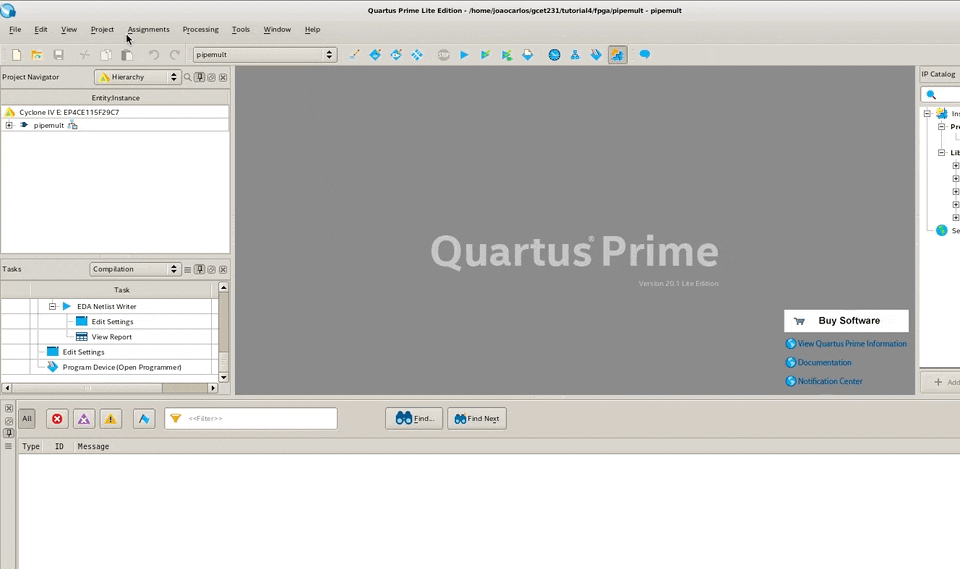

Em seguida, com a caixa de diálogo **Settings**, podemos controlar o processamento de compilação. Clique em **Setting** no menu **Assignments**. A página **Compilation Process Settings** permite que você defina opções que afetam o tempo de compilação, incluindo o número de processadores a serem usados e quais ferramentas são executadas em uma compilação completa.

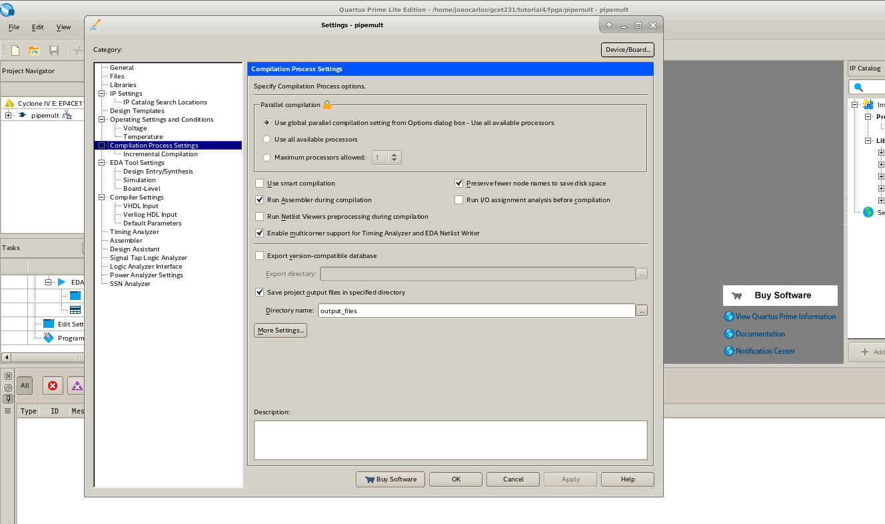

A parte mais importante, entretanto é a página configurações do compilador (**Compiler Settings**), o qual permite controlar o processo de _fitting_. Aqui você pode escolher entre uma abordagem equilibrada (**Balanced**) ou ter o compilador otimizado para desempenho (**Performance**), quando o objetivo é aumentar a velocidade. É possível ainda orientar o processo para reduzir o consumo de energia (**Power**), ou para a área (**Área**) para reduzir a quantidade de uso de elementos lógicos. Por enquanto, vamos deixar a configuração no método equilibrado (**Balanced**).

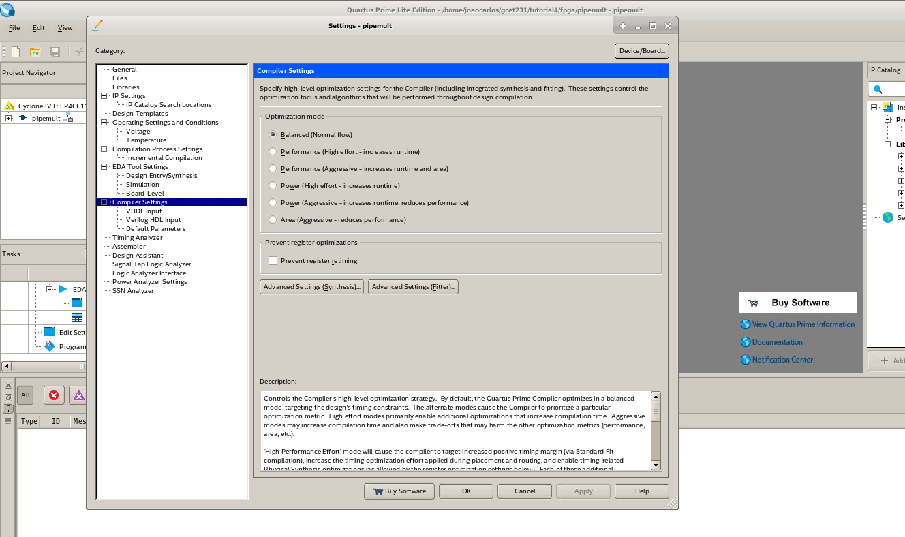

As configurações também podem ser modificadas por meio do uso de _scripts_. Vamos dar uma nova olhada no aquivo `pipemult.qsf`. No menu **File**, selecione **Open**, altere o tipo de arquivo **All files**, selecione o aquivo `pipemult.qsf` e clique em **Open**.

Como vimos anteriormente, aqui você encontrará os comandos Tcl que controlam todas as configurações do compilador. Quando você insere configurações da interface GUI ou digitando comandos Tcl em um console Tcl do Quartus, essas configurações são também armazenadas no arquivo `.qsf` do projeto.

Aponte para a opção **Utility Windows** no menu **View** e clique em **Tcl Console** para abrir o terminal Tcl. Qualquer dos comandos listados no arquivo `pipemult.qsf` poderia ter sido inserido aqui. Uma coisa importante de se destacar é o fato de que o Quartus Prime pode ser inteiramente controlado a partir da linha de comando Tcl.

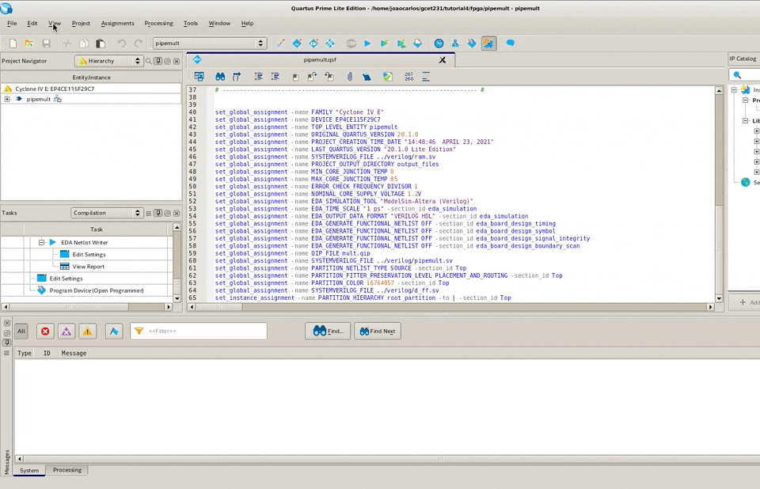

Agora, vamos compilar o nosso projeto. Feche o arquivo `pipemult.qsf` clicando no `x` no canto superior direito da aba de arquivos do Quartus Prime. Clique duas vezes em `pipemult` na hierarquia do _Project Navigator_ e o código fonte deve aparecer se ele ainda não estiver aberto. No menu **Processing**, selecione **Start Compilation**. Isto irá executar uma compilação completa e pode levar de alguns segundos a vários minutos, dependendo do poder de processamento do seu computador.

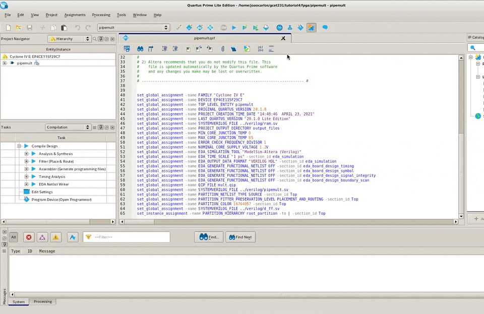

Observe que o progresso da compilação é exibido na janela **Task** e as mensagens de sistema e de processamento aparecem automaticamente na janela Messages, localizada na parte inferior da janela do Quartus Prime. Além disso, observe que os resultados da compilação são exibidos na janela de **Compilation Report**.

À medida em que cada etapa é concluída com sucesso, você perceberá uma marca de seleção verde reconfortante ao lado de cada etapa do processo na janela de tarefas. Se forem encontrados erros, a etapa será de cor vermelha.

Ao final da compilação, podemos visualizar uma representação dos arquivos de hierarquia do projeto e os componentes na janela **Project Navigator**. Vamos agora explorar o que podemos fazer a partir desta janela. A hierarquia inteira do projeto é exibida uma vez que o projeto é analisado. Pelo menos após a etapa de análise e elaboração (Analysis & Elaboration), que corresponde ao primeiro passo da síntese do circuito. O projeto é composto por um módulo de nível superior e quaisquer outros arquivos ou módulos que são referenciados pelo nível superior, ou por qualquer outro arquivo na hierarquia. Clique com o botão direito do mouse para localizar a módulo em outras ferramentas no Quartus Prime. Esse processo também é conhecido como cross probing (ou depuração cruzada).

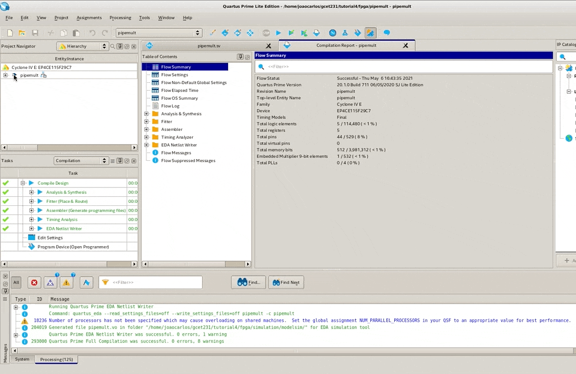

Ainda na janela **Project Navigator**, também podemos ver todos os arquivos no design, os módulos que compõem o projeto, uma lista de componentes IP, onde encontraremos nosso multiplicador, e por último uma lista de revisões. Notem que, atualmente, há apenas uma revisão. A seguir, você aprenderá a fazer pequenas alterações e criar novas revisões.

O relatório de compilação fornece informações detalhadas sobre a compilação atual. Quando é aberto pela primeira vez, o relatório **Flow Summary** fornece informações sobre a situação final da compilação, as revisões atuais e a versão do Quartus Prime, o nome da entidade _top-level_, o dispositivo de destino atual e o número total de células lógicas, pinos, memória, multiplicadores e PLLs usado no dispositivo.

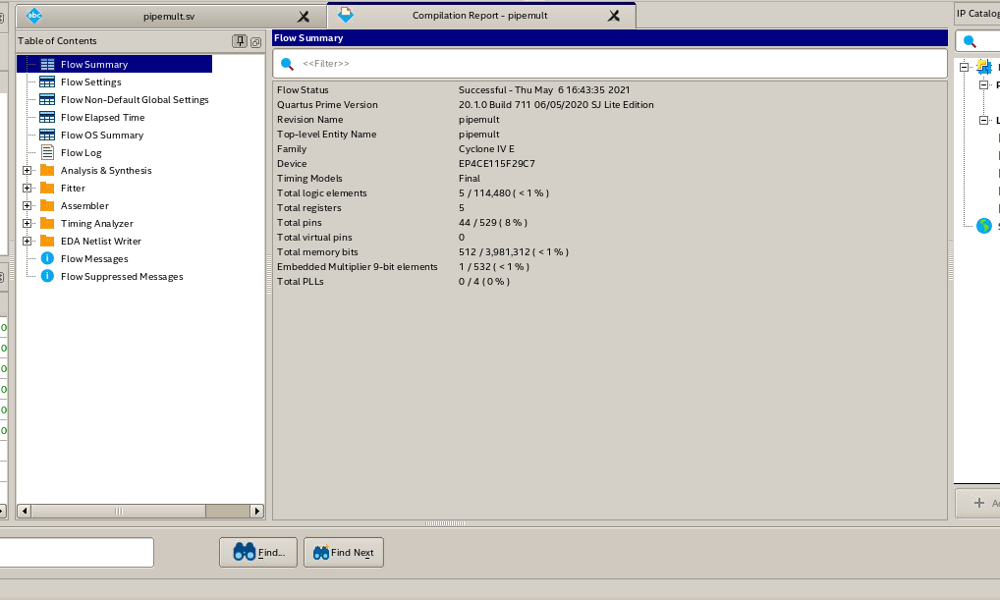

Outros relatórios de compilação fornecem informações sobre os demais aspectos resultantes do processo de compilação, incluindo o uso de recursos do dispositivo e informações detalhadas de temporização. Você pode selecionar o relatório que deseja exibir no painel à esquerda da janela **Compilation Report**.

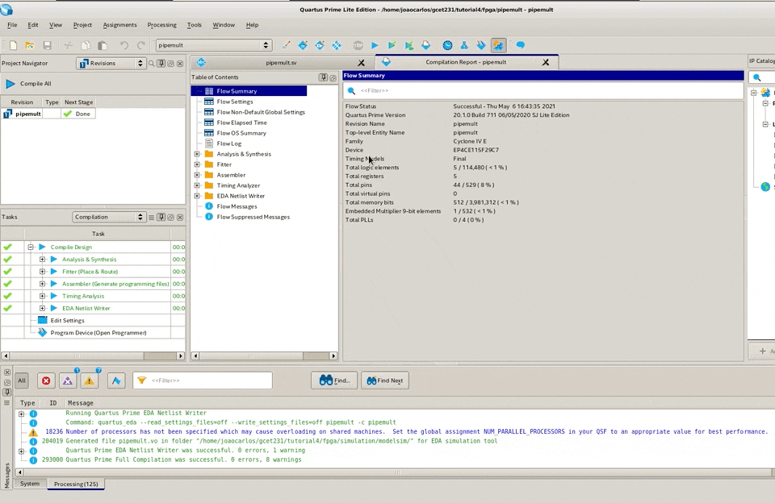

> **_Faça você mesmo:_** clique na opção do relatório Timequest Time Analyser. Em seguida, clique no modelo Slow 1200mv 85C e depois em Fmax Summary. Essa informação representa a frequência máxima que o clock pode operar neste circuito sob estas condições específicas. Slow, significa o resultado mais lento das estatísticas de temporização características para o dispositivo, 1.200 milivolts, corresponde à tensão do circuito e 85C, representa a temperatura de operação.
> Qual foi a frequência máxima (Fmax) que você encontrou?
> Agora clique no modelo Slow 1200mv 0C e verifique o valor da frequência máxima. O resultado é consistente com o que nós sabemos sobre o desempenho de circuitos baseados em semicondutores?

A informações sobre a frequência máxima de operação de um circuito é uma métrica crítica usada para avaliar o desempenho do FPGA e é determinada pela ferramenta de análise temporal. Por vezes, essa é uma etapa que exige tempo e esforço dos projetistas.

Você também pode querer examinar os relatórios para os tempo de _setup_ e _hold_ do circuito, clicando em **Setup Summary** ou **Hold Summary**. O valor de _slack_ corresponde à margem de tempo que o dispositivo possui para o parâmetro de temporização indicado. Valores de slack positivos indicam que as restrições de tempo foram atendidas, enquanto valores negativos indicam que houve uma violação, e serão destacados em vermelho quando ocorrerem. Você analisará o seu circuito no analisador de temporização mais adiante.

O Quartus Prime permite experimentar as configurações do compilador e as regras de projeto, também conhecidas como _design constrains_ utilizando revisões para comparar resultados de compilação. Na janela **Project Navigator**, clique na guia direita e selecione **Revisions** . Quando criamos uma revisão, o Quartus Prime cria um arquivo de configuração `.qsf` separado, o qual contém todas as configurações e atribuições relacionadas a essa revisão e coloca-o no nível superior para o projeto.

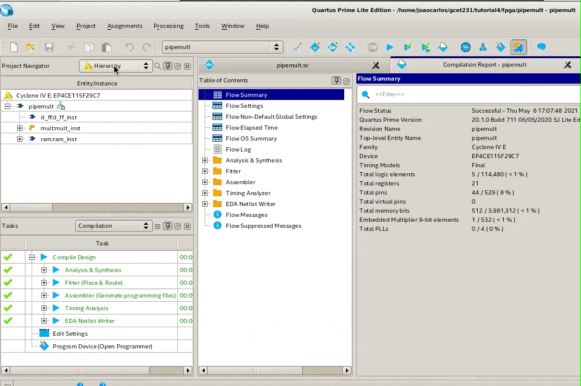

A caixa de diálogo de revisões permite que você selecione uma revisão para o projeto atual e, em seguida, faça edições nela. Uma marca de seleção ou um nome de revisão em negrito indica a revisão atual. Para abrir a caixa de diálogo de revisões, clique em **Revisions** no menu **Project**. Para criar uma nova revisão com base em uma já existente, fazemos duplo clique em _new revision_ na caixa de diálogo **Revisions**. Na caixa de diálogo **Create Revision**, digite `pipemult-performance` para o nome da revisão, selecione `pipemult` como a referência a qual queremos basear a nova revisão e, em seguida, clique em **OK** para fechar a caixa de diálogo.

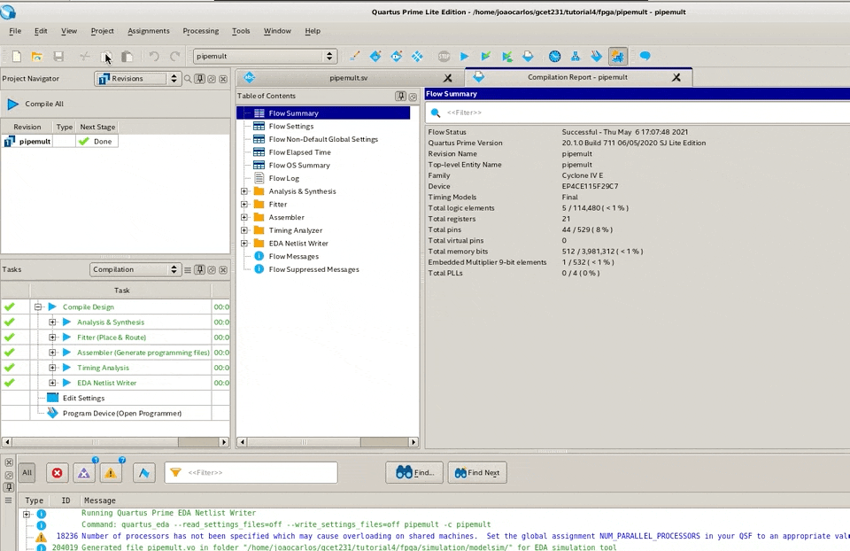

Pode levar um minuto ou mais para que a nova revisão seja efetivamente criada. Vamos agora alterar a forma como esta revisão do nosso projeto é compilada de modo a otimizar o desempenho do circuito. No menu de **Assignments**, clique em **Settings**. Nas configurações de compilação (Compilation Settings), altere a configuração de _Balanced_ para _Agressive Performance_. Clique em **Apply** e depois em **OK** para concluir a alteração.

De volta ao **Project Navigator**, clique em **Compile All** e aguarda. Esse processo levará algum tempo, pois ambas as revisões são compiladas. Alternativamente, você pode compilar apenas a nova revisão do projeto clicando com o botão direito do mouse na nova revisão.

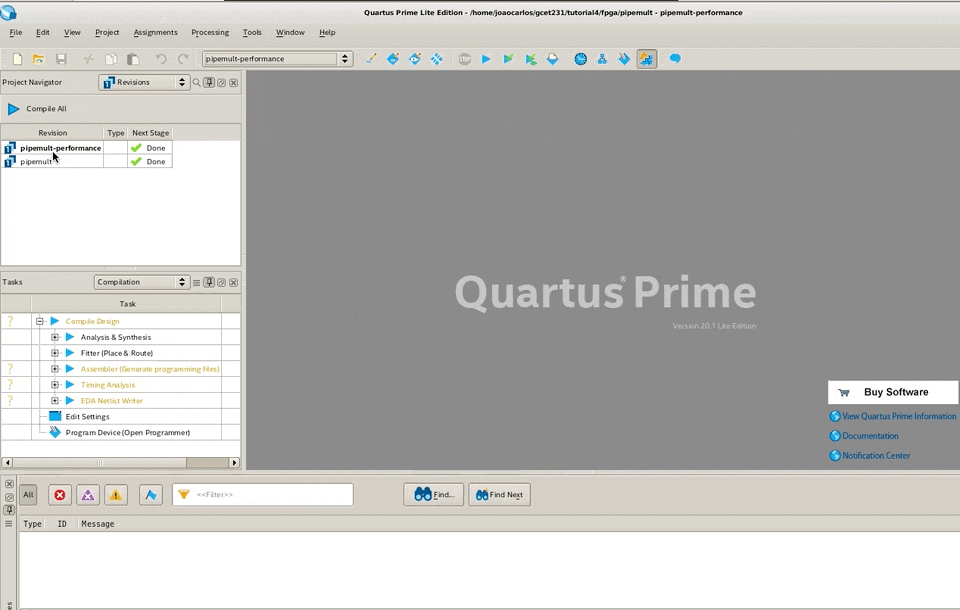

Ao final do processo você deve ser capaz de visualizar o a janela de **Summary Report** referente à revisão `pipemult-performance`. Caso contrário, clique com o botão direito do mouse em `pipemult-performance` no **Project Navigator** e defina-o como a revisão atual, clicando em **Set Current Revision**.

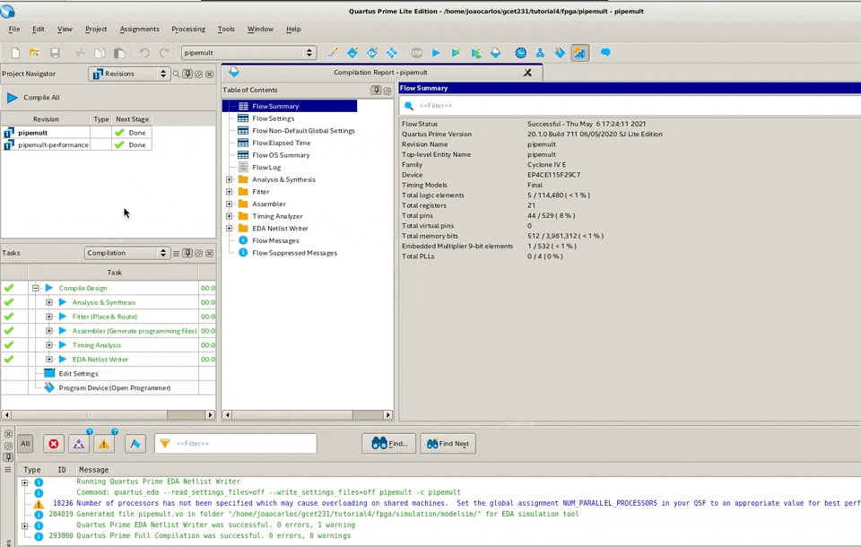

Expanda o relatório do analisador de tempo (**TimeQuest Timing Analyzer**) e analise os parâmetros de `Fmax` de cada modelo como fizemos na revisão anterior. Você deve notar que o `Fmax` aumentou em relação à revisão original como nós poderíamos esperar. Para comparar as revisões, no menu **Project** selecione **Revisions** e clique em **Comparar**. A caixa de diálogo **Compare Revisions** deve aparecer. Clique na guia **Results** se ele ainda não estiver selecionado, e clique em cada cabeçalho para expandi-lo.

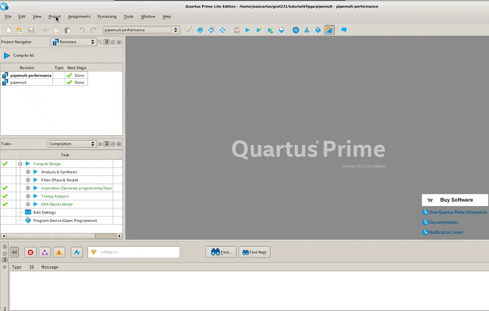

> **_Faça você mesmo:_** exporte os resultados para um arquivo de planilha na extensão .csv e analise-o em detalhes. O que mudou de uma revisão para outra?

Feche a janela **Compare Revisions** clicando em **Close**. Agora, salve o projeto clicando em **Save Project** no menu **File**. Vamos também salvar o que fizemos até agora em nosso arquivo, o que permite comprime o projeto para economizar espaço, possibilitando que ele seja compartilhado com colegas e equipe técnica com maior facilidade.

Para criar arquivar o seu projeto, no menu **Project** selecione **Archive Project** ou clique duas vezes em **Archive Project** na janela **Tasks**. Se você não vir essa informação na janela **Tasks**, defina a guia na janela como **Full Design**. A caixa de diálogo **Archive Project** deve ser exibida para você. Selecione a caixa **Archive all revisions** e, em seguida, clique em **Archive**.

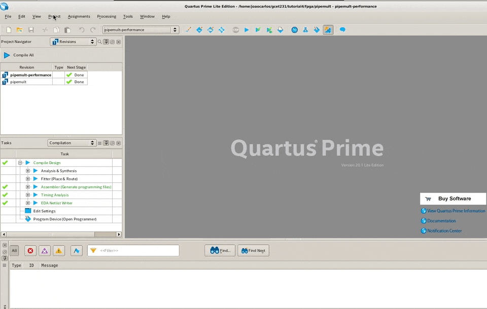

Se você olhar agora no diretório do projeto, você verá que o arquivo `pipemult.qar` foi criado. Para restaurar um projeto, a partir do menu **Project**, selecione **Restore Archived Project**.

Em resumo, o Quartus Prime apresenta os recursos de gerenciamento de projetos e controles de compilação para ajudar seu projeto a ser bem-sucedido. Com essa parte do tutorial, você aprendeu a especificar as configurações do compilador para obter os resultados desejados; como executar a compilação completa; como analisar os resultados da compilação; como criar uma revisão do seu projeto; e como arquivar um projeto.

| [Expandindo o Projeto usando SystemVerilog](../pages/systemverilog.md) |  TBC |
| :----------------------------------------------------------- | ---: |